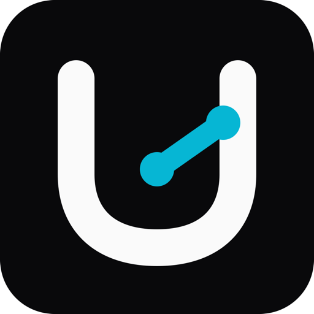
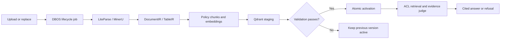
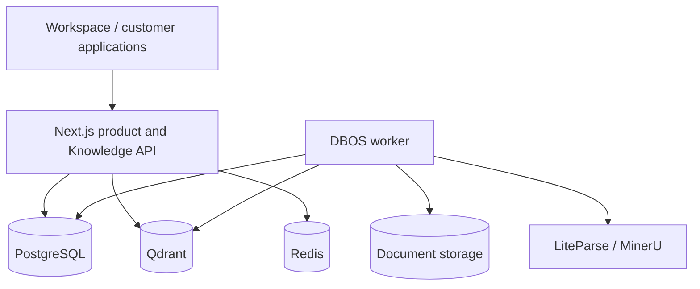

<div align="center">
  
  <h1>UnoRAG</h1>
  <p><strong>Private, permission-aware enterprise knowledge grounded in evidence.</strong></p>
  <p>
    <a href="./README.zh-CN.md">简体中文</a> ·
    <a href="./docs/PRODUCT.md">Product</a> ·
    <a href="./docs/ARCHITECTURE.md">Architecture</a> ·
    <a href="./docs/DEPLOYMENT.md">Deployment</a> ·
    <a href="./docs/INTEGRATION.md">API</a>
  </p>
</div>

UnoRAG turns internal documents into governed, callable, and verifiable knowledge. Teams can use the
official Workspace or embed the same Retrieve and Ask capabilities into support products, employee
portals, and agents.


## Enterprise RAG Is More Than Chat

UnoRAG covers the lifecycle that determines whether RAG can be trusted in production: authorization
before retrieval, atomic document versions, structure-aware parsing, evidence-backed citations,
explicit refusal, durable processing, and deployment-level acceptance.

| Enterprise requirement | UnoRAG approach |
|---|---|
| Answers must be verifiable | Locatable citations, evidence preview and adjudication; refuse or clarify when coverage is weak |
| Knowledge must not cross boundaries | Organization, workspace, document ACL, and group scope enforced in PostgreSQL and Qdrant |
| Updates must not interrupt service | Stage and validate a new generation, activate atomically, preserve the previous version on failure |
| PDFs and tables must retain meaning | DocumentIR and TableIR preserve pages, headings, headers, units, row ranges, and source coordinates |
| Processing must recover | DBOS runs parsing, embedding, indexing, deletion, and cleanup with retries, cancellation, and reconciliation |
| Quality changes must be measurable | Versioned prompts and real-file golden sets gate fact coverage, document recall, refusal accuracy, and latency |
| Operators need a product-level view | The scoped Operations Center works standalone; optional OTel Ops and metadata-only Langfuse integrations add infrastructure and AI-engineering views |
| Delivery must fit customer infrastructure | Compose reference topology, Helm starter, least-privilege roles, recovery tooling, and release gates |

## One Knowledge Core, Two Product Surfaces

**UnoRAG Workspace** gives administrators and employees a complete product for workspaces, members,
libraries, document versions, visible jobs, streaming questions, evidence inspection, follow-ups, and archives.

**UnoRAG Knowledge API** lets existing applications use scoped Service Keys with
`POST /api/v1/retrieve` and `POST /api/v1/ask`. It shares the Workspace authorization, version,
retrieval, and citation truth instead of creating a second data plane.

## From Document to Grounded Answer



Chunking is structure first: headings, pages, tables, and code take priority; recursive splitting
enforces hard limits; semantic splitting is reserved for long narrative regions without explicit
structure. Retrieval supports dense search, optional BM25+RRF, reranking, and deterministic table
execution. LangGraph.js orchestrates Ask, while Vercel AI SDK streams model output.

## Private Deployment

Customers retain control of databases, documents, model endpoints, and parser credentials. Only the
Next.js product edge is public; workers, PostgreSQL, Qdrant, Redis, and ParserProviders remain private.

The host requires Docker, Docker Compose v2, and Python 3. Python is used only by host-side configuration
migration and acceptance utilities; the product runtime is TypeScript/Node.js.

```bash
cd deploy/compose
./scripts/init-config.sh
# Edit ../config/runtime.env, runtime.secret, and bootstrap.env
./scripts/install.sh
```

Open <http://localhost/> and verify readiness:

```bash
curl -sf http://localhost/api/rag/health
```

See [Private Deployment](./docs/DEPLOYMENT.md) for upgrades, rollback, backup, restore, and Kubernetes.

## Architecture



Next.js owns identity, workspaces, RBAC/ACL, public APIs, retrieval, LangGraph, citations, and
conversations. DBOS owns durable document workflows. PostgreSQL is the only business source of truth;
Qdrant contains security-scoped retrieval projections.

## Documentation

- [Product and capability boundaries](./docs/PRODUCT.md)
- [System architecture](./docs/ARCHITECTURE.md)
- [Knowledge API](./docs/INTEGRATION.md)
- [Private deployment](./docs/DEPLOYMENT.md)
- [Operations](./docs/OPERATIONS.md)
- [Release and acceptance](./docs/RELEASE.md)
- [Development](./docs/DEVELOPMENT.md)

## License

UnoRAG is currently delivered as commercial private-deployment software. This repository does not grant
an open-source license for use, redistribution, or production deployment. Production use, source delivery,
customization, and support are governed by a separate commercial agreement.
