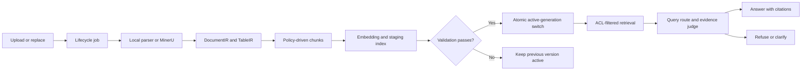
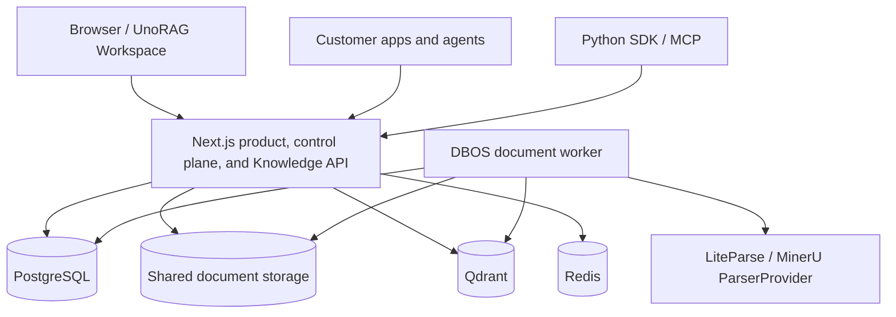

<div align="center">
  
  <h1>UnoRAG</h1>
  <p><strong>Private, permission-aware enterprise knowledge that answers with evidence.</strong></p>
  <p>
    <a href="./README.zh-CN.md">简体中文</a> ·
    <a href="./docs/STATUS.md">Project status</a> ·
    <a href="./docs/ARCHITECTURE.md">Architecture</a> ·
    <a href="./deploy/README.md">Private deployment</a>
  </p>
</div>

UnoRAG turns internal documents into a governed knowledge service. It combines a
ready-to-use workspace with stable Retrieve and Ask APIs, so teams can use the
official interface or embed the same evidence layer in an existing portal,
support product, or agent.

It is designed around the parts that make enterprise RAG trustworthy: access
control before retrieval, atomic document versions, structure-aware ingestion,
traceable citations, explicit refusal, and deployment-level acceptance.

## Quick Start

### Private deployment

Docker and Docker Compose are required. Initialize the split configuration,
fill the three generated files, and run the installer:

```bash
cd deploy/compose
./scripts/init-config.sh
# Edit ../config/runtime.env, runtime.secret, and bootstrap.env
./scripts/install.sh
```

Open <http://localhost/> after installation. Check readiness with:

```bash
curl -sf http://localhost/api/rag/health
```

See the [private deployment guide](./deploy/README.md) for upgrades, rollback,
backup/restore, and Helm.

### Local development

Local development requires Docker, Node.js 22, and pnpm 9:

```bash
docker compose up -d
cp -n apps/web/.env.example apps/web/.env.local
pnpm install --frozen-lockfile
pnpm --filter web dev
```

Run the DBOS worker in a second terminal after configuring its database and
model environment. Follow the copyable
[developer workflow](./docs/DEV.md).

## Why UnoRAG

| Need | What UnoRAG provides |
|---|---|
| Answers people can verify | Clickable citations, evidence preview, confidence adjudication, and refusal when coverage is insufficient |
| Knowledge that stays private | Organization, workspace, principal, and group context is enforced in metadata and Qdrant retrieval |
| Safe document updates | New generations are indexed in staging and activated atomically; a failed replacement leaves the old version serving |
| Complex document support | TXT, Markdown, PDF, DOCX, CSV, and XLSX; optional MinerU escalation for scanned and complex PDFs |
| More than generic chunking | DocumentIR and TableIR preserve headings, pages, tables, code, units, and row provenance before policy-driven chunking |
| A product and a platform | Official Workspace for people; Service Key APIs, Python SDK, and MCP for existing applications |
| A deployable system | Docker Compose delivery, Helm starter, migrations, workers, backup/restore, health checks, release gates, and runbooks |

## Product Experience

**UnoRAG Workspace** gives administrators and employees one place to:

- create and switch workspaces;
- invite members and assign viewer, editor, or admin roles;
- create libraries and configure document access;
- upload, replace, reindex, and delete documents with visible job progress;
- ask streaming questions, inspect evidence, and continue follow-up questions;
- archive selected conversations and inspect retrieval traces;
- create scoped Service Keys for application integration.

**UnoRAG Knowledge API** lets customer systems use the same governed retrieval
kernel without adopting the Workspace UI. Retrieve and Ask v1 are available
today; the Python SDK and MCP server are thin clients of that API.

## How Knowledge Becomes an Answer



The default chunking policy is structure first. Heading, page, table, and code
boundaries take priority; recursive splitting enforces hard size limits, and
semantic splitting is reserved for long narrative regions where it adds value.
Tables are normalized and indexed with headers, units, row ranges, and source
coordinates so row-level answers do not lose column meaning.

## Architecture



Next.js owns product identity, organizations, workspaces, libraries, public APIs,
native retrieval, LangGraph execution, citations, conversations, and the browser
security boundary. DBOS executes durable parsing, embedding, indexing, ACL
projection, deletion, and generation cleanup. PostgreSQL is the only business
source of truth; Qdrant stores scoped retrieval projections.

## Current Capability

| Area | Status |
|---|---|
| Workspace, local authentication, invitations, roles, multi-workspace creation and switching | Available |
| Workspace and document ACL enforcement through retrieval | Available; group-management UI is not yet included |
| Atomic versions, lifecycle jobs, retries, cancellation, cleanup, and old-version fallback | Available |
| Structure-aware ingestion, MinerU adapters, TableIR, hybrid retrieval, reranking, query routing, citations, and refusal | Available |
| Retrieve/Ask v1, Service Keys, Python SDK, and MCP | Available |
| OIDC/SSO, public document lifecycle APIs, OpenAI-compatible endpoint, first-class S3, and hardened Kubernetes autoscaling/network policy | Planned |
| ChartIR and database execution for very large tables | Planned |

The detailed, code-backed matrix lives in [Project status](./docs/STATUS.md).
Historical acceptance reports are evidence for specific builds and
environments, not a timeless product claim.

## Deployment

UnoRAG is currently optimized for private deployment:

- **Docker Compose** is the reference single-node delivery topology.
- **Helm** is a starter for customer-managed Kubernetes infrastructure.
- Model, embedding, parser, database, and registry credentials are supplied by
  the customer deployment and are never baked into images.
- Workers and data stores remain private; browser and external clients enter
  through the Next.js product edge.

Start with the [private deployment guide](./deploy/README.md). For local
development, see [docs/DEV.md](./docs/DEV.md).

## Engineering Confidence

The repository includes Web and native RAG test suites, a preserved evaluation
corpus, cross-tenant isolation fuses, real-file ingestion fixtures, browser
acceptance, image CVE scanning, and digest-pinned release manifests. Recovery
and fault-injection automation is being rebaselined for the TS-only topology.

The current `webch` environment is a **preproduction simulation**, not a formal
customer production deployment. Customer production approval remains
deployment-specific and must cover capacity, identity integration, recovery
objectives, monitoring ownership, and security policy.

## Documentation

- [Product boundaries](./docs/PRODUCT.md)
- [Implementation status](./docs/STATUS.md)
- [Architecture](./docs/ARCHITECTURE.md)
- [Roadmap](./docs/ROADMAP.md)
- [Knowledge API](./docs/INTEGRATION.md)
- [Developer guide](./docs/DEV.md)
- [Repository handoff](./docs/HANDOFF.md)
- [Acceptance and operations](./docs/acceptance/README.md)

## License

The repository does not currently declare a public open-source license. Confirm
commercial or source-distribution terms before external distribution.
