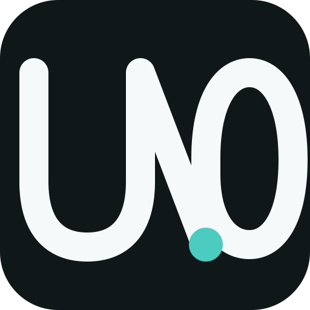
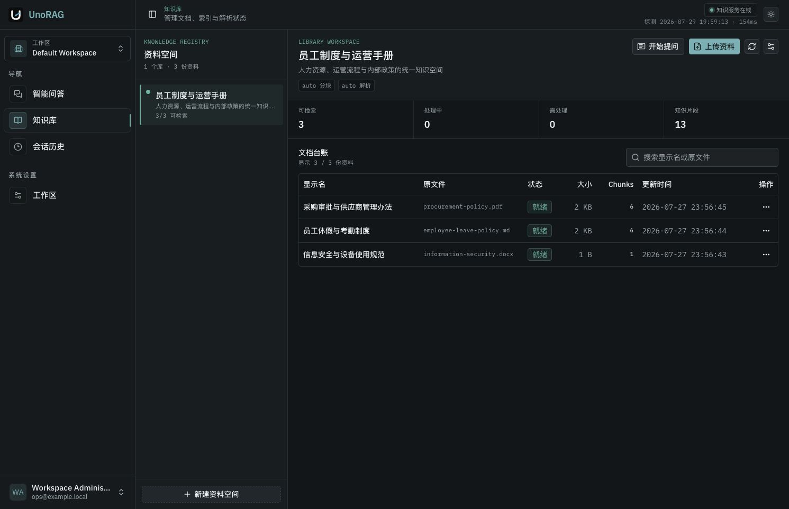
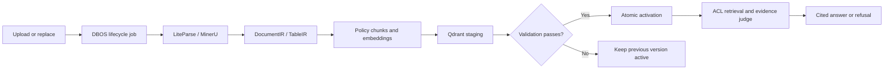
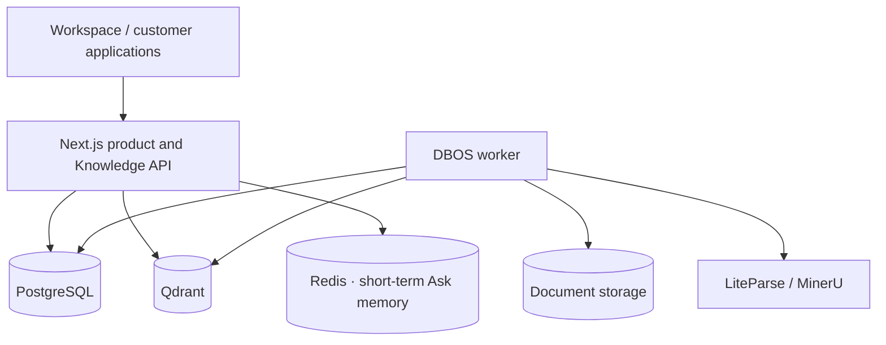

<div align="center">
  
  <h1>UnoRAG</h1>
  <p><strong>Private, permission-aware enterprise knowledge grounded in evidence.</strong></p>
  <p>
    <a href="https://unorag.unobyte.dev">Live Demo</a> ·
    <a href="./README.zh-CN.md">简体中文</a> ·
    <a href="./docs/STATUS.md">Status</a> ·
    <a href="./docs/PRODUCT.md">Product</a> ·
    <a href="./docs/ARCHITECTURE.md">Architecture</a> ·
    <a href="./docs/DEPLOYMENT.md">Deployment</a> ·
    <a href="./docs/INTEGRATION.md">API</a>
  </p>
</div>

> Live instance: [unorag.unobyte.dev](https://unorag.unobyte.dev). It is intended for product demonstration and release acceptance; self-hosted deployments retain control of data, models, and parser credentials.

UnoRAG turns internal documents into governed, callable, and verifiable knowledge. Teams can use the
official Workspace or embed the same Retrieve and Ask capabilities into support products, employee
portals, and agents.



## Enterprise RAG Is More Than Chat

UnoRAG covers the lifecycle that determines whether RAG can be trusted in production: authorization
before retrieval, atomic document versions, structure-aware parsing, evidence-backed citations,
explicit refusal, durable processing, and deployment-level acceptance.

| Enterprise requirement | UnoRAG approach |
|---|---|
| Answers must be verifiable | Locatable citations, evidence preview and adjudication; refuse or clarify when coverage is weak |
| Knowledge must not cross boundaries | PostgreSQL business queries bind organization, workspace, and resource scope; Qdrant applies mandatory filters and verifies returned hits |
| Updates must not interrupt service | Stage and validate a new generation, activate atomically, preserve the previous version on failure |
| PDFs and tables must retain meaning | DocumentIR and TableIR preserve pages, headings, headers, units, row ranges, and source coordinates |
| Processing must recover | DBOS runs parsing, embedding, indexing, deletion, and cleanup with retries, cancellation, and reconciliation |
| Quality changes must be measurable | Versioned prompts and real-file golden sets gate fact coverage, document recall, refusal accuracy, and latency |
| Operators need a product-level view | The scoped Operations Center works standalone; optional OTel Ops and metadata-only Langfuse integrations add infrastructure and AI-engineering views |
| Delivery must fit customer infrastructure | Compose reference topology, Helm starter, separate Web / Worker / Migrator database roles, recovery tooling, and release gates |

## One Knowledge Core, Two Product Surfaces

**UnoRAG Workspace** gives administrators and employees a complete product for workspaces, members,
libraries, document versions, visible jobs, streaming questions, evidence inspection, follow-ups, and archives.

**UnoRAG Knowledge API** lets existing applications use scoped Service Keys with
`POST /api/v1/retrieve` and `POST /api/v1/ask`. It shares the Workspace authorization, version,
retrieval, and citation truth instead of creating a second data plane.

## From Document to Grounded Answer



Chunking is structure first: headings, pages, tables, and code take priority; recursive splitting
enforces hard limits; semantic splitting is reserved for long narrative regions without explicit
structure. Retrieval defaults to dense search with optional reranking. Application-level BM25+RRF
is available for small and medium knowledge bases, alongside deterministic table execution.
LangGraph.js orchestrates Ask, while Vercel AI SDK streams model output.

## Private Deployment

Customers retain control of databases, documents, model endpoints, and parser credentials. Only the
Next.js product edge is public; workers, PostgreSQL, Qdrant, Redis, and ParserProviders remain private.

UnoRAG currently targets **one isolated deployment per customer**. Organization identifies that
enterprise, while workspaces separate internal departments, projects, and permissions. A shared
public multi-tenant SaaS is not part of the current product boundary.

For a local evaluation, install Docker Desktop or Docker Engine with Compose v2, then run:

```bash
./start.sh
```

The script securely asks for `LLM_API_KEY`, generates local secrets, builds the stack, and opens
<http://localhost:8080/>. It uses a temporary Docker helper when host Python is unavailable.
Where npmjs.org is unreliable, local source builds may use
`./start.sh --npm-registry https://registry.npmmirror.com` without changing locked dependency versions.

Production installation still uses a digest-pinned release manifest and the explicit deployment runbook:

```bash
cd deploy/compose
./scripts/init-config.sh
# Edit ../config/runtime.env, runtime.secret, and bootstrap.env
./scripts/prepare-runtime-db-secrets.sh --bundled-postgres
./scripts/install.sh --manifest /path/to/release.env
```

For the default local launch, verify readiness with:

```bash
curl -sf http://localhost:8080/api/rag/health/ready
```

See [Private Deployment](./docs/DEPLOYMENT.md) for upgrades, rollback, backup, restore, and Kubernetes.

## Architecture



Next.js owns identity, workspaces, RBAC/ACL, public APIs, retrieval, LangGraph, citations, and
conversations. DBOS owns durable document workflows. PostgreSQL is the only business source of truth;
Qdrant contains security-scoped retrieval projections.

## Documentation

- [Current status, gaps, and next steps](./docs/STATUS.md)
- [Product and capability boundaries](./docs/PRODUCT.md)
- [System architecture](./docs/ARCHITECTURE.md)
- [Knowledge API](./docs/INTEGRATION.md)
- [Private deployment](./docs/DEPLOYMENT.md)
- [Operations](./docs/OPERATIONS.md)
- [Release and acceptance](./docs/RELEASE.md)
- [Changelog and known limitations](./CHANGELOG.md)
- [Development](./docs/DEVELOPMENT.md)
- [Open-source readiness audit](./docs/OPEN_SOURCE_READINESS.md)

## Open Source

UnoRAG is one fully open-source distribution with no paid feature wall. Private deployment,
Ops Stack assets, Langfuse integration, evaluation, and generic provider adapters belong to the same product;
professional deployment, integration, tuning, customization, training, and SLA support remain available as services.

The source code is licensed under [Apache License 2.0](./LICENSE), and the GitHub repository is public.
Product names and logos are governed separately by the [trademark policy](./TRADEMARKS.md); forks and
hosted services remain welcome when they use distinct branding and describe their UnoRAG relationship truthfully.
Asset provenance, third-party notices, SBOM/provenance, and image signing are in place. The stable
`v0.1.0` release remains gated by one final, commit-bound product and recovery acceptance run. See
[ADR-0007](./docs/adr/0007-fully-open-source-product-and-services.md) and the
[open-source readiness audit](./docs/OPEN_SOURCE_READINESS.md).

Contributions, support, and security reports are described in [CONTRIBUTING.md](./CONTRIBUTING.md),
[SUPPORT.md](./SUPPORT.md), and [SECURITY.md](./SECURITY.md).
