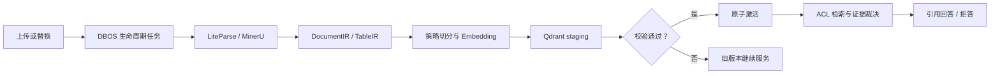
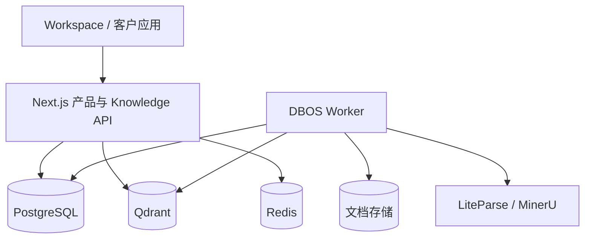

<div align="center">
  
  <h1>UnoRAG</h1>
  <p><strong>可私有化部署、权限感知、以证据为中心的企业知识服务。</strong></p>
  <p>
    <a href="./README.md">English</a> ·
    <a href="./docs/STATUS.md">现状</a> ·
    <a href="./docs/PRODUCT.md">产品</a> ·
    <a href="./docs/ARCHITECTURE.md">架构</a> ·
    <a href="./docs/DEPLOYMENT.md">部署</a> ·
    <a href="./docs/INTEGRATION.md">API</a>
  </p>
</div>

UnoRAG 将企业文档转化为可治理、可调用、可核验的知识服务。团队可以直接使用官方
Workspace，也可以通过 Retrieve / Ask API，把同一套知识能力嵌入客服、售后、企业门户或 Agent。


## 企业 RAG 不只是问答

UnoRAG 关注真正影响企业上线的完整链路：检索前权限过滤、文档版本原子切换、复杂文档
结构保留、有据引用、证据不足时拒答，以及可执行的安装、升级、恢复和发布验收。

| 企业要求 | UnoRAG 的处理方式 |
|---|---|
| 回答必须可核对 | 可定位引用、证据预览与裁决；覆盖不足时拒答或澄清 |
| 知识不能越权 | organization、Workspace、文档 ACL 和用户组贯穿 PostgreSQL 与 Qdrant |
| 更新不能影响在线服务 | 新 generation 独立索引并校验，成功后原子激活，失败继续服务旧版本 |
| PDF 和表格不能切坏 | DocumentIR / TableIR 保留页面、标题、表头、单位、行范围和来源坐标 |
| 任务必须可恢复 | DBOS 执行解析、Embedding、索引、删除和清理，支持重试、取消与对账 |
| 质量变更必须可衡量 | 版本化 Prompt 与真实文件黄金集门禁事实覆盖、文档召回、拒答准确率和延迟 |
| 运维必须看得懂 | 原生运行中心可独立工作；可选 OTel Ops 与 metadata-only Langfuse 接入分别补充基础设施和 AI 工程视图 |
| 必须进入客户基础设施 | Compose 参考拓扑、Helm starter、最小权限数据库角色、备份恢复和发布门禁 |

## 一个知识内核，两种使用方式

**UnoRAG Workspace** 面向管理员和员工：管理 Workspace、成员、文库、文档版本和任务；
进行流式问答、查看证据、连续追问并归档会话。

**UnoRAG Knowledge API** 面向已有业务系统：使用带 scope 的 Service Key 调用
`POST /api/v1/retrieve` 或 `POST /api/v1/ask`，无需采用 UnoRAG UI，也不会产生第二套权限和索引事实。

## 从文档到有据回答



默认切分策略是**结构优先**：标题、页面、表格和代码边界优先；递归切分负责硬上限；
语义切分只用于较长、缺少显式结构的叙事区域。检索支持 Dense、可选 BM25+RRF、Rerank
和确定性表格执行，Ask 使用 LangGraph.js 编排并通过 Vercel AI SDK 流式生成。

## 私有部署

客户保有数据库、文档、模型和解析器密钥。公网只暴露 Next.js 产品边界，Worker、PostgreSQL、
Qdrant、Redis 和 ParserProvider 留在内网。

本地体验只需先安装 Docker Desktop，或 Docker Engine + Compose v2，然后执行：

```bash
./start.sh
```

脚本会安全询问 `LLM_API_KEY`，自动生成本地密钥、构建完整环境并打开
<http://localhost:8080/>。宿主机没有 Python 时会使用临时 Docker helper，不要求额外安装开发环境。
在 npmjs.org 网络不稳定的环境中，可使用
`./start.sh --npm-registry https://registry.npmmirror.com`，依赖版本仍由 lockfile 固定。

正式客户安装仍须使用 digest-pinned release manifest 和完整部署流程：

```bash
cd deploy/compose
./scripts/init-config.sh
# 编辑 ../config/runtime.env、runtime.secret、bootstrap.env
./scripts/prepare-runtime-db-secrets.sh --bundled-postgres
./scripts/install.sh --manifest /path/to/release.env
```

使用默认本地启动配置时，可这样检查就绪状态：

```bash
curl -sf http://localhost:8080/api/rag/health/ready
```

升级、回滚、备份、恢复和 Kubernetes 说明见[私有化部署](./docs/DEPLOYMENT.md)。

## 系统架构



Next.js 负责身份、Workspace、RBAC/ACL、公开 API、检索、LangGraph、引用与会话；DBOS Worker
负责持久化文档工作流。PostgreSQL 是唯一业务事实源，Qdrant 只保存带安全作用域的检索投影。

## 文档

- [当前能力、缺口与下一步](./docs/STATUS.md)
- [产品定位与能力边界](./docs/PRODUCT.md)
- [系统架构](./docs/ARCHITECTURE.md)
- [Knowledge API](./docs/INTEGRATION.md)
- [私有化部署](./docs/DEPLOYMENT.md)
- [运维指南](./docs/OPERATIONS.md)
- [发布与验收](./docs/RELEASE.md)
- [开发指南](./docs/DEVELOPMENT.md)
- [开源发布准备审计](./docs/OPEN_SOURCE_READINESS.md)

## 开源许可

UnoRAG 采用单一、功能完整的开源发行版，不设置付费功能墙。私有化部署、Ops Stack、Langfuse、
评测和通用 Provider 集成都属于同一产品；部署、集成、调优、定制、培训与 SLA 支持可作为专业服务。

源代码已采用 [Apache License 2.0](./LICENSE)。仓库可见性和首次公开发行仍须通过素材来源、供应链证明
与发布候选验收门禁。详见 [ADR-0007](./docs/adr/0007-fully-open-source-product-and-services.md) 和
[开源发布准备审计](./docs/OPEN_SOURCE_READINESS.md)。

贡献、支持和安全报告方式分别见 [CONTRIBUTING.md](./CONTRIBUTING.md)、[SUPPORT.md](./SUPPORT.md)
与 [SECURITY.md](./SECURITY.md)。
