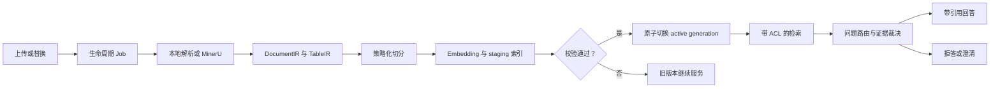
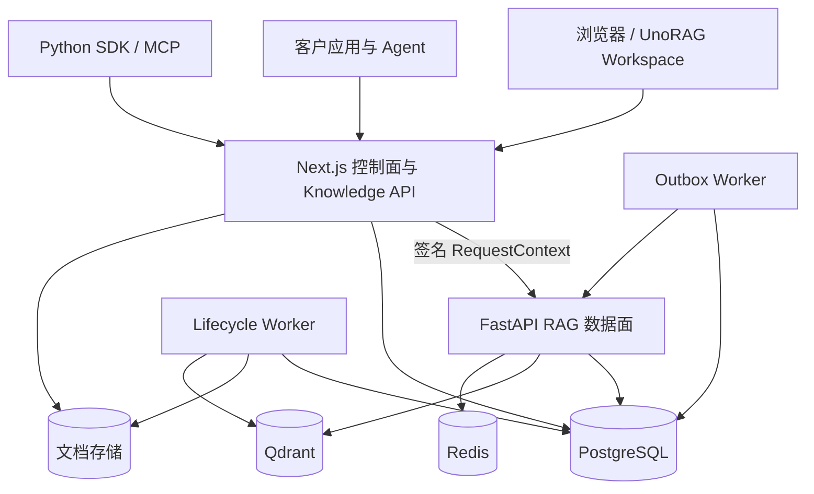

  
  <h1>UnoRAG</h1>
  
<strong>可私有化部署、权限感知、以证据为中心的企业知识服务。</strong>

  

    <a href="./README.md">English</a> ·
    <a href="./docs/STATUS.md">项目状态</a> ·
    <a href="./docs/ARCHITECTURE.md">架构</a> ·
    <a href="./deploy/README.md">私有化部署</a>
  

UnoRAG 将企业内部文档转化为可治理、可调用、可核验的知识服务。团队既可以直接使用
官方 Workspace，也可以通过 Retrieve / Ask API，把同一套知识能力嵌入客服、售后、
企业门户或 Agent。

它关注的不是“把文档塞进向量库”，而是企业 RAG 真正困难的部分：检索前权限过滤、
文档版本原子切换、复杂文档结构保留、有据引用、证据不足时拒答，以及可执行的交付验收。

## 为什么选择 UnoRAG

| 企业需求 | UnoRAG 的处理方式 |
|---|---|
| 回答必须可核对 | 可点击引用、证据预览、证据裁决；覆盖不足时拒答或澄清 |
| 知识不能越权 | organization、workspace、成员与用户组上下文贯穿元数据和 Qdrant 检索 |
| 更新不能影响在线服务 | 新 generation 在 staging 建索引，校验通过后原子激活；替换失败继续服务旧版本 |
| 要处理复杂文档 | 支持 TXT、Markdown、PDF、DOCX、CSV、XLSX；扫描件和复杂 PDF 可升级 MinerU |
| 不能只靠固定字符切分 | DocumentIR / TableIR 先保留标题、页面、表格、代码、单位与来源，再按策略切分 |
| 既要产品，也要集成能力 | 官方 Workspace 面向人；Service Key API、Python SDK、MCP 面向已有系统 |
| 必须能私有交付 | Compose、Helm 起步包、迁移、Worker、备份恢复、健康检查、发布门禁与 runbook |

## 产品体验

**UnoRAG Workspace** 目前支持：

- 创建与切换 Workspace；
- 邀请成员并分配 viewer、editor、admin 角色；
- 创建文库并配置文档可见范围；
- 上传、替换、重索引、删除文档，并查看 Job 进度；
- 流式问答、查看证据、连续追问；
- 主动归档会话并查看检索调试信息；
- 创建带 scope 的 Service Key 供业务系统接入。

**UnoRAG Knowledge API** 让已有系统无需采用官方 UI，也能调用同一套受治理的知识内核。
Retrieve / Ask v1 已可用，Python SDK 和 MCP Server 都只是该 API 的薄适配层。

## 从文档到有据回答

默认策略是“结构优先”：标题、页面、表格和代码边界优先；递归切分负责硬上限；
语义切分只用于较长、缺少显式结构的叙事文本。表格会保留表头、单位、行范围和原始
坐标，避免检索到一行数据却丢失列含义。

## 系统架构

Next.js 负责身份、组织、Workspace、文库、文档生命周期元数据、审计和浏览器安全边界；
FastAPI 负责解析、索引、检索、LangGraph 执行、引用和归档问答。两者通过 PostgreSQL
Job 与 Outbox 协作，各自拥有明确的数据所有权，不维护两套业务事实。

## 当前能力边界

| 领域 | 状态 |
|---|---|
| 本地登录、邀请、角色、Workspace 创建与切换 | 已可用 |
| Workspace / 文档 ACL 贯穿检索 | 已可用；用户组管理 UI 尚未提供 |
| 原子版本、Job、重试、取消、旧版兜底、generation 清理 | 已可用 |
| 结构化入库、MinerU、TableIR、混合检索、重排、问题路由、引用与拒答 | 已可用 |
| Retrieve/Ask v1、Service Key、Python SDK、MCP | 已可用 |
| OIDC/SSO、对外文档生命周期 API、OpenAI-compatible、S3 一等支持、K8s 完整硬化 | 规划中 |
| ChartIR、超大表数据库执行 | 规划中 |

完整且与代码对应的状态矩阵见 [项目状态](./docs/STATUS.md)。历史验收报告只证明某个
版本和环境，不代表永久产品承诺。

## 私有化部署

UnoRAG 当前优先服务私有化部署：

- Docker Compose 是单机参考交付拓扑；
- Helm 是客户 Kubernetes 环境的起步骨架；
- 模型、Embedding、解析器、数据库和镜像仓库凭据由客户部署提供，不写入镜像；
- FastAPI 只在内网运行，浏览器和外部客户端统一经过 Next.js 控制面。

部署从 [私有化部署指南](./deploy/README.md) 开始，本地开发见
[docs/DEV.md](./docs/DEV.md)。

## 工程可信度

仓库包含 API/Web 测试、RAG 黄金集、Python/JavaScript 策略一致性检查、跨租户隔离
熔断门禁、真实文件入库样例、真实浏览器验收、备份恢复与故障注入、镜像 CVE 扫描和
基于 digest 的发布清单。

当前 `webch` 是模拟线上条件的**预发布环境**，不是正式客户生产环境。客户正式上线
仍需针对实际机器规格、身份系统、RPO/RTO、监控责任和安全策略完成部署级验收。

## 文档

- [产品边界](./docs/PRODUCT.md)
- [实现状态](./docs/STATUS.md)
- [系统架构](./docs/ARCHITECTURE.md)
- [路线图](./docs/ROADMAP.md)
- [Knowledge API](./docs/INTEGRATION.md)
- [开发指南](./docs/DEV.md)
- [验收与运维](./docs/acceptance/README.md)

## 许可

仓库当前未声明公开开源许可证。对外分发前需要先确认商业或源码授权条款。
