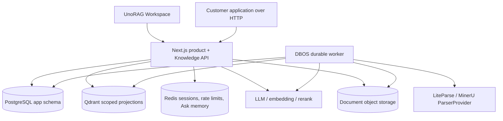
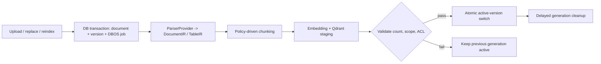

# UnoRAG 系统架构

本文描述当前产品运行时。迁移过程和被取代的设计保存在 [`adr/`](./adr/)，不作为操作指南。

## 系统边界

UnoRAG 是可私有化部署的知识产品，也提供可嵌入的 Knowledge API。浏览器通过 Session、
客户应用通过 Service Key 进入同一个 Next.js 产品边界。Worker 和数据存储永远不是公网入口。
当前默认交付模型是一位客户一套独立实例；Organization 表示该客户企业，Workspace 用于企业内部
部门、项目和权限隔离，而不是让互不相关的客户共享一个公网 SaaS 实例。



仓库中没有内部 FastAPI 产品服务、outbox Worker、Python 生命周期 Worker 或单独维护的客户端运行时。

## 职责所有权

| Component | Owns | Must not own |
|---|---|---|
| Next.js | auth, organizations, workspaces, RBAC/ACL, libraries, documents, versions, jobs, audit, conversations, Retrieve/Ask, LangGraph | background execution or unscoped vector access |
| DBOS worker | durable ingest, ACL projection, deletion, cleanup, retries, cancellation and progress | user sessions, membership, library authorization decisions |
| PostgreSQL `app` | the only business source of truth and durable job intent | vector payloads |
| Qdrant | derived chunks, sections, tables, vectors and security payload | active-version authority or product metadata |
| ParserProvider | document analysis and DocumentIR output | business database writes, authorization or activation |

Drizzle is the only application-schema migration owner. Runtime identities are
separate: `unorag_web`, `unorag_worker`, `unorag_migrator`, and the dedicated DBOS
system-database login.

## Web 请求与状态边界

`src/proxy.ts` 只在进入 `/app/*` 前快速校验签名 Session Cookie 的格式、签名和有效期，减少无效请求
进入 React Server Component 渲染。它不是完整授权层，也不保护 Route Handler。页面和 API 仍必须通过
服务端 Session/DAL 校验 Redis 活跃 `sid`、PostgreSQL 密码版本、成员关系、Workspace 和权限；所有写操作
都在对应 Route Handler 内再次校验 capability。密码变更由 PostgreSQL 版本使旧 Cookie 失效，登出与
Workspace 切换由 Redis 即时撤销旧 `sid`。

浏览器中的服务端状态由 TanStack Query React Adapter 管理：

- query key 必须包含 organization 和 workspace，切换 Workspace 时 Session Provider 会重建 Query Client；
- library、document、version 和 health 使用独立 query，不建立第二份全局业务状态；
- mutation 完成后的权威刷新会先取消同 key 的旧请求，避免旧快照覆盖新结果；
- 后台健康探测失败时可以保留上次成功载荷用于诊断，但 readiness 必须立即 fail closed；
- Ask token 流仍使用显式 SSE reducer，因为它是有顺序的事件流，不是普通请求缓存。

PostgreSQL 始终是业务事实源，TanStack Query 只是 Workspace 内的短期客户端投影。Replace 和 reindex
Route Handler 共用 `document-version-command.ts`：按 library -> document -> source version 顺序加锁，并在
一个事务中完成旧任务取消、新 version/job 创建、desired pointer、library 状态和审计写入。

## 请求安全

The authenticated server session or Service Key produces an authoritative scope:

```text
organization_id + workspace_id + principal_ids + group_ids
+ allowed library/document ids + active generation snapshot
```

Routes resolve this scope from PostgreSQL. Callers cannot supply or widen it.
Every Qdrant search composes mandatory organization, workspace, ACL, document,
and active-generation filters. Missing dimensions fail closed, and an empty
allow-list matches nothing. PostgreSQL currently relies on explicitly scoped
application queries, composite constraints, and separated runtime roles; it does
not install Row-Level Security policies. RLS remains an optional defense-in-depth
hardening item, not a claimed runtime guarantee.

## 文档生命周期



All new jobs use `execution_engine=dbos` and `workflow_id=job_id`. Migration 0020
refuses to retire the old runtime while a non-terminal Python-owned job exists;
terminal legacy rows remain historical. DBOS dispatch and reconciliation are
idempotent, and Qdrant staging points are invisible until activation.

## 解析与切分

`ParserProvider` is the stable boundary. LiteParse is local and default. MinerU can
run through a self-hosted endpoint inside the customer trust boundary or through the
302.AI upload/task/ZIP API. The external provider is fail-closed unless deployment
configuration explicitly allows document egress; credentials exist only in the
worker Secret. Unsupported provider names fail worker startup.

Parsing produces DocumentIR before chunking. The policy is structure-first:

1. preserve headings, page ranges, lists, code, figures and table boundaries;
2. use profile-specific recursive limits as a hard size guard;
3. use semantic splitting only for long narrative regions;
4. index chunk, section and table records with stable provenance;
5. keep TableIR headers, normalized units, row groups and contributing citations.

Small and medium tables remain RAG records with layered row groups and summaries.
Very large SQL-style execution is deliberately deferred; operational data should
usually be queried from its source database.

Successful structured table operations render their answer directly from the typed
execution result. They do not pass rows through an LLM for a second lossy rewrite.
Row previews are bounded and must disclose both the displayed and total row counts
when truncated; citations continue to point at every contributing row group.

## 检索与问答

Native Retrieve resolves scope, embeds the query, applies mandatory Qdrant filters,
optionally reranks results, and maps strict citations. The current BM25+RRF path
builds an application-level lexical index from a bounded corpus and is intended for
small and medium knowledge bases; server-side sparse retrieval remains an evaluated
future upgrade rather than a current scale claim.

应用层 BM25 不得按 library 或 generation 共享高权限主体构建的语料缓存。任何复用都必须包含规范化的
授权指纹、再次执行 ACL/version 校验并具备可靠失效机制。Qdrant sparse 只有在真实客户语料证明质量、
容量和回滚收益，并通过跨 Workspace、ACL、active generation 与删除隔离门禁后，才能替换当前路径。

Native Ask uses LangGraph.js for orchestration:

```text
route -> plan -> clarify | retrieve -> table execute -> judge
      -> rewrite/retry | refuse | stream answer with citations
```

Vercel AI SDK provides model calls, structured output and streaming. LangChain core
types are used only where they remove adapter friction. LlamaIndex is not a second
runtime; it may later appear behind a retrieval or parser tool boundary.

## 可观测性边界

可观测性分为三层，彼此共享上下文但不互相构成运行依赖：

| 层级 | 默认状态 | 责任 |
|---|---|---|
| 原生诊断 | 默认启用 | 运行中心、Ask/Job 阶段账本、审计、持久告警、Pino JSON 和低基数 `/metrics` |
| Ops Stack | 可选 | Collector、Prometheus、Grafana、Loki、Tempo 与 Alertmanager |
| AI 工程 | 可选 | 通过 Collector 向 Langfuse 输出 metadata-only AI Trace 和确定性评测分数 |

`request_id` 是对外稳定的业务关联号；公共 API 的 `trace_id` 是它的兼容别名，不是 W3C Trace ID。
`otel_trace_id` 只覆盖一次同步执行。DBOS 任务通过稳定的 `job_id` / `workflow_id` 关联，每次执行尝试使用
独立 Trace，不能构造跨越排队、重试和恢复周期的超长父子 Trace。

原生诊断表和外部观测默认不保存问题、回答、Prompt、引用正文、检索块、认证头或凭据。高基数的组织、
Workspace、文档和请求标识只进入受控日志或 Trace attribute，不作为 Prometheus label。任何 Collector、
Grafana、Tempo、Loki 或 Langfuse 故障都必须 fail-soft，不得改变 Ask、检索、入库和生命周期结果。
具体启用、保留、告警和排障见 [OPERATIONS.md](./OPERATIONS.md)。

## 部署模型

The release contains four Node images:

| Image | Purpose |
|---|---|
| `web` | Next.js product edge |
| `migrator` | forward-only Drizzle migration |
| `ops` | bootstrap, inspection and backfill commands |
| `worker` | DBOS executor and control loop |

Compose is the reference single-node private deployment. Helm is the Kubernetes
starter. Model, parser, database and registry credentials are customer-supplied.
安装、升级和恢复见 [DEPLOYMENT.md](./DEPLOYMENT.md)，生产门禁见 [RELEASE.md](./RELEASE.md)。
