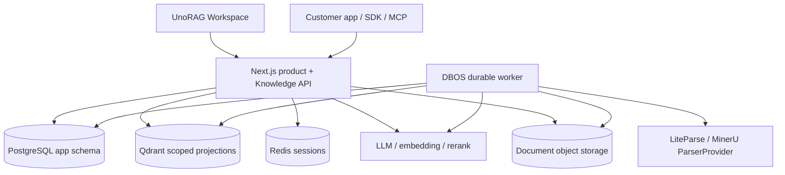
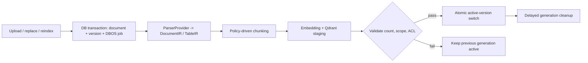

# UnoRAG Architecture

> Current implementation on `refactor/ts-core-runtime`, updated 2026-08-02.
> ADR-0005 is implemented by commits `5061ac0` and `8b38294`.

## System Boundary

UnoRAG is a private-deployable knowledge product and an embeddable Knowledge API.
All browser, SDK, MCP, and customer application traffic enters one Next.js product
edge. Workers and data stores are never public entry points.



There is no internal FastAPI product service, outbox worker, or Python lifecycle
worker. Optional Python SDK and MCP packages are clients of the public HTTP API;
they do not own business logic.

## Ownership

| Component | Owns | Must not own |
|---|---|---|
| Next.js | auth, organizations, workspaces, RBAC/ACL, libraries, documents, versions, jobs, audit, conversations, Retrieve/Ask, LangGraph | background execution or unscoped vector access |
| DBOS worker | durable ingest, ACL projection, deletion, cleanup, retries, cancellation and progress | user sessions, membership, library authorization decisions |
| PostgreSQL `app` | the only business source of truth and durable job intent | vector payloads |
| Qdrant | derived chunks, sections, tables, vectors and security payload | active-version authority or product metadata |
| ParserProvider | document analysis and DocumentIR output | business database writes, authorization or activation |

Drizzle is the only application-schema migration owner. Runtime identities are
separate: `unorag_web`, `unorag_worker`, `unorag_migrator`, and the dedicated DBOS
system-database login.

## Request Security

The authenticated server session or Service Key produces an authoritative scope:

```text
organization_id + workspace_id + principal_ids + group_ids
+ allowed library/document ids + active generation snapshot
```

Routes resolve this scope from PostgreSQL. Callers cannot supply or widen it.
Every Qdrant search composes mandatory organization, workspace, ACL, document,
and active-generation filters. Missing dimensions fail closed, and an empty
allow-list matches nothing. PostgreSQL RLS is defense in depth, not a replacement
for explicit Qdrant filters.

## Document Lifecycle



All new jobs use `execution_engine=dbos` and `workflow_id=job_id`. Migration 0020
refuses to retire the old runtime while a non-terminal Python-owned job exists;
terminal legacy rows remain historical. DBOS dispatch and reconciliation are
idempotent, and Qdrant staging points are invisible until activation.

## Parsing And Chunking

`ParserProvider` is the stable boundary. LiteParse is local and default. A configured
self-hosted MinerU endpoint inside the customer trust boundary is registered for OCR,
complex layouts, figures, and tables. Cloud ParserProviders are not implemented in
the current runtime and unsupported provider names fail worker startup.

Parsing produces DocumentIR before chunking. The policy is structure-first:

1. preserve headings, page ranges, lists, code, figures and table boundaries;
2. use profile-specific recursive limits as a hard size guard;
3. use semantic splitting only for long narrative regions;
4. index chunk, section and table records with stable provenance;
5. keep TableIR headers, normalized units, row groups and contributing citations.

Small and medium tables remain RAG records with layered row groups and summaries.
Very large SQL-style execution is deliberately deferred; operational data should
usually be queried from its source database.

## Ask And Retrieval

Native Retrieve resolves scope, embeds the query, applies mandatory Qdrant filters,
optionally performs BM25 hybrid fusion and reranking, and maps strict citations.

Native Ask uses LangGraph.js for orchestration:

```text
route -> plan -> clarify | retrieve -> table execute -> judge
      -> rewrite/retry | refuse | stream answer with citations
```

Vercel AI SDK provides model calls, structured output and streaming. LangChain core
types are used only where they remove adapter friction. LlamaIndex is not a second
runtime; it may later appear behind a retrieval or parser tool boundary.

## Deployment

The release contains four Node images:

| Image | Purpose |
|---|---|
| `web` | Next.js product edge |
| `migrator` | forward-only Drizzle migration |
| `ops` | bootstrap, inspection and backfill commands |
| `worker` | DBOS executor and control loop |

Compose is the reference single-node private deployment. Helm is the Kubernetes
starter. Model, parser, database and registry credentials are customer-supplied.
See [private deployment](./runbooks/private-deployment.md) and
[implementation status](./STATUS.md).
