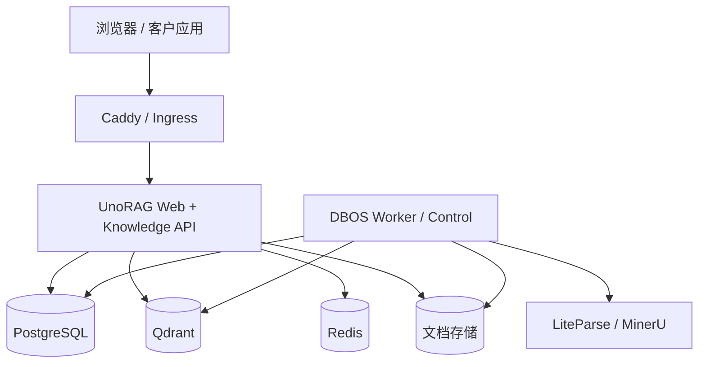

# UnoRAG 私有化部署

UnoRAG 提供两种客户部署入口：Docker Compose 是单机参考拓扑，Helm Chart 是客户托管
Kubernetes 的起点。两者使用相同的四个 Node 镜像和相同的产品数据模型。

## 运行拓扑



公网只暴露 Web。Worker、PostgreSQL、Qdrant、Redis、DBOS 管理端点和 ParserProvider
必须位于客户内网。PostgreSQL `app` schema 是唯一业务事实源，DBOS 使用独立 system database。

## Compose 安装

宿主机需要 Docker、Docker Compose v2 和 Python 3。Python 只用于配置迁移及验收脚本，
四个产品镜像均为 Node 运行时。

### 本地体验一键启动

macOS、Linux 或 WSL 已安装并启动 Docker 时，可在仓库根目录运行：

```bash
./start.sh
```

首次运行会安全询问 `LLM_API_KEY`，生成 gitignored 的数据库、Session 和管理员密钥，使用默认
`8080` 端口构建并启动完整 Compose 环境。宿主机没有 Python 时，脚本通过临时 Docker helper 执行
配置初始化。可使用 `./start.sh --help` 查看端口、Ops Stack、manifest 和无浏览器模式。

该入口用于本地体验和开发，默认构建当前工作树，**不属于正式客户交付**。生产安装必须继续使用下面的
release manifest、平台预检和显式配置流程。模型凭据不会被内置；非交互环境必须通过
`LLM_API_KEY` 提供。

### 正式安装

`v0.1` 发布物当前只认证 `linux/amd64`。生产安装前必须确认宿主机或 Kubernetes 节点提供该架构；
`linux/arm64` 和 multi-arch 尚不属于支持范围。Apple Silicon 本地验收可以只对四个产品服务显式设置
`platform: linux/amd64`，但模拟运行不代表生产容量结论，也不得让全局
`DOCKER_DEFAULT_PLATFORM` 连带改变 PostgreSQL、Qdrant 和 Redis 等基础设施镜像架构。
官方 manifest 使用 `UNORAG_IMAGE_PLATFORM` 声明产品镜像架构，安装与升级会在拉取镜像或进入维护
窗口前校验 Docker Engine。架构不匹配默认直接拒绝；仅本地验收可在已提供产品服务 platform overlay
后显式传入 `--allow-platform-emulation`。该参数不是生产部署选项。

```bash
cd deploy/compose
./scripts/init-config.sh
# 编辑 ../config/runtime.env、runtime.secret、bootstrap.env
./scripts/prepare-runtime-db-secrets.sh --bundled-postgres
./scripts/install.sh --manifest /path/to/release-acr.env
# 仅 Apple Silicon 本地验收，并且 overlay 只设置 UnoRAG 产品服务：
UNORAG_COMPOSE_OVERLAY=./docker-compose.local-amd64.yml \
  ./scripts/install.sh --manifest /path/to/release-acr.env --allow-platform-emulation
```

正式安装必须使用发布 workflow 生成的 digest manifest。没有 `--manifest` 时安装脚本会构建当前
工作树镜像，该模式只用于本地开发，不属于可交付安装。manifest 会同时固定四个镜像和 DBOS
application version；缺少字段、使用 tag、`latest` 或不完整 digest 时安装会直接拒绝。

需要集中指标、日志和 Trace 时，设置 `runtime.secret` 中的 `GRAFANA_ADMIN_PASSWORD` 后显式启用：

```bash
./scripts/install.sh --with-observability
```

该选项增加 Collector、Prometheus、Grafana、Loki、Tempo 和 Alertmanager，但不改变业务数据事实源。
Grafana 默认仅监听 `127.0.0.1:3300`，其它观测后端不发布宿主机端口；停止它们不会停止 UnoRAG。

已有独立 Langfuse 或 Langfuse Cloud 项目时，可再配置 `LANGFUSE_OTLP_ENDPOINT` 和 Collector-only
`LANGFUSE_OTLP_AUTHORIZATION`，使用 `./scripts/install.sh --with-langfuse`。该模式自动包含 Ops Stack，
并由 Collector 将脱敏后的同一 Trace 双写 Tempo/Langfuse；详见 [LANGFUSE.md](./LANGFUSE.md)。

必要 Secret 包括：

- `POSTGRES_PASSWORD`
- 独立的 `UNORAG_WEB_DB_PASSWORD`、`UNORAG_WORKER_DB_PASSWORD`、`UNORAG_DBOS_DB_PASSWORD`
- 至少 32 字符的 `UNORAG_SESSION_SECRET`
- `LLM_API_KEY`
- 仅用于首次初始化的 `UNORAG_ADMIN_PASSWORD`

外部 PostgreSQL 应由客户创建等价最小权限角色，并分别配置 `WEB_DATABASE_URL`、
`WORKER_DATABASE_URL`、`DBOS_SYSTEM_DATABASE_URL` 与 `MIGRATOR_DATABASE_URL`。
Web 和 Worker 运行身份不得拥有 DDL 权限。

安装程序依次启动基础设施、执行 Drizzle 迁移、配置数据库角色、初始化首个组织、Workspace
和管理员、启动 DBOS、对账 ACL 投影，最后启动 Web 与 Caddy。

如需部署覆盖文件，必须在每次操作中显式选择：

```bash
export UNORAG_COMPOSE_OVERLAY=./docker-compose.customer.yml
./scripts/install.sh
```

同一变量也应供后续升级、备份、恢复和 `mk_compose` 命令使用，避免意外切换拓扑。

### 公网 HTTPS

域名 A 记录指向部署主机并完成公共解析后，在 `runtime.env` 中配置：

```dotenv
UNORAG_DOMAIN=unorag.example.com
UNORAG_BASE_URL=https://unorag.example.com
```

使用仓库内置公网覆盖层启动：

```bash
cd deploy/compose
source scripts/compose-env.sh
UNORAG_COMPOSE_OVERLAY=./docker-compose.public.yml mk_compose up -d
```

Caddy 会自动申请和续期证书，并将 HTTP 重定向到 HTTPS。该覆盖层只发布 80/443，证书与
Caddy 状态保存在命名卷中；Web 之外的数据服务和 Worker 仍不发布宿主机端口。UnoRAG 的公开
参考实例位于 [unorag.unobyte.dev](https://unorag.unobyte.dev)。

## ParserProvider

LiteParse 是 Worker 内的本地快速路径。自托管 MinerU 示例：

```dotenv
MINERU_PROVIDER=self_hosted
MINERU_SELF_HOSTED_URL=http://mineru:6006
MINERU_TRANSPORT=sync
```

MinerU 地址应位于客户批准的信任边界内。选择 302.AI 会把文档上传到客户网络之外，必须
同时开启外部处理开关，且 API Key 只能进入 Worker Secret：

```dotenv
MINERU_PROVIDER=302ai
MINERU_302_BASE_URL=https://api.302.ai
EXTERNAL_PARSER_ALLOWED=true
MINERU_API_KEY=...
```

`local_only` 文库策略始终禁止云端解析。外部处理开关关闭时，路由器不得选择 302.AI。

部署管理员可通过 `PARSER_POLL_INTERVAL_MS`、`PARSER_MAX_WAIT_MS` 和逗号分隔的
`PARSER_RETRY_BACKOFF_MS` 调整解析任务轮询、总等待时间与瞬时故障退避。submit 重试复用同一
idempotency key，poll/fetch 重试复用同一远端 task；401/403 等永久错误不重试，429 优先服从
`Retry-After`。这些参数是部署能力，不进入 Workspace 或文库设置。

## 健康检查

```bash
curl -fsS http://localhost/api/rag/health/live | jq .
curl -fsS http://localhost/api/rag/health/ready | jq .
curl -fsS http://localhost/api/rag/health | jq .
source deploy/compose/scripts/compose-env.sh
mk_compose ps
mk_compose --profile ops run --rm inspect-lifecycle
```

| 组件 | 预期 |
|---|---|
| Web liveness | `/api/rag/health/live` 返回 200；只说明进程可响应，不探测下游依赖 |
| Web readiness | `/api/rag/health/ready` 仅在 PostgreSQL、Qdrant 和模型凭证均可用时返回 200，否则返回 503 并停止接收新流量 |
| Web 状态详情 | `/api/rag/health` 保持兼容，返回 `ask_ready`、`degraded` 与 `reasons`，供 UI 和诊断读取 |
| DBOS Worker | 私有 `:3001/dbos-healthz` 正常 |
| DBOS Control | ready marker 持续更新 |
| PostgreSQL | `pg_isready` 正常 |
| Qdrant | 私有 `:6333` ready |
| Redis | `redis-cli ping` 正常 |

## 镜像与升级

发布物包含 `web`、`migrator`、`ops` 和 `worker` 四个镜像。发布 workflow 会把同一次构建
推送到镜像仓库，并产出引用四个镜像 digest 的 manifest。生产升级只接受这类已归档的
digest manifest，禁止直接使用浮动 `latest`。`upgrade.sh` 也接受带版本 tag 的 manifest，
但该入口只用于本地 RC 验收和无法访问 registry 时的 break-glass 操作，不能替代生产发布物。
当前镜像架构支持范围以本页 Compose 安装章节为准；上线验收必须在客户实际节点架构上重跑。

```bash
cd deploy/compose
./scripts/backup.sh ./backups/pre-upgrade
./scripts/upgrade.sh --manifest /path/to/release-registry.env
# 已部署 Ops Stack 时保留 OTLP 连接和看板：
./scripts/upgrade.sh --manifest /path/to/release-registry.env --with-observability
```

升级前应确认备份可读、生命周期巡检无 dead/stuck/pending ACL，并归档当前配置摘要。正式发布
manifest 会从 Git commit 生成 `unorag-<sha>` DBOS application version；不得在不同提交间复用
`dev-local` 或历史版本。升级也会先校验 manifest 的产品镜像架构；本地模拟升级使用与安装相同的
overlay 和显式开关。脚本随后：

1. 保存当前四镜像引用与 DBOS application version；
2. 拉取候选镜像；若 DBOS version 改变，停止 Web/edge 接收新写入，并等待业务任务表与旧版本
   DBOS workflow 同时归零；
3. 停止旧 control/worker，执行只向前数据库迁移与运行时角色验证；
4. 启动新版本 DBOS worker/control，执行 ACL 对账与生命周期巡检；
5. 替换 Web，检查结构化健康状态并运行真实上传、Ask、替换、删除与隔离冒烟。

排空默认最多等待 1800 秒，可通过 `DBOS_UPGRADE_DRAIN_TIMEOUT_SECONDS` 调整。超时会拒绝版本切换并
恢复旧服务，不会让新 Worker 接管旧版本 workflow。版本变化后的自动回滚同样先停止入口并排空新版本；
若无法排空，脚本保留新镜像和维护状态，要求运维处理，而不会做可能遗留任务的强制回滚。

上一个镜像集合保存在 `.upgrade-state/previous-images.env`。升级过程中任一步失败，脚本会恢复
旧应用镜像引用；运维人员也可把该文件作为 manifest 再次执行 `upgrade.sh` 完成手工应用回滚。
数据库不会自动向下迁移，因此旧镜像必须与新 schema 保持兼容，破坏性变化必须采用 expand / migrate /
contract 窗口。

Compose 是单机参考拓扑：DBOS version 变化使用明确的短维护窗口，单副本 Web 替换也可能产生连接
中断，不承诺零停机。需要无感更新时，不能只增加副本；还要让旧、新 DBOS application version 的
Worker 并存直至旧 workflow 排空，并使用 readiness、PDB 与负载均衡完成该客户拓扑的专项验收。

## 备份与恢复

参考 Compose 备份覆盖 PostgreSQL、DBOS 与 Qdrant。`local` 模式同时归档文档卷；`cos` 模式只记录
远程桶边界，文档对象依赖 COS 自身的版本控制、跨地域复制或独立备份策略。Redis 会话可重建，
不属于恢复集。

```bash
./scripts/backup.sh ./backups/$(date +%Y%m%dT%H%M%S)
CONFIRM=YES ./scripts/restore.sh ./backups/<backup-id>
```

恢复顺序固定为：停止应用、恢复 PostgreSQL、恢复或核验文档对象、恢复 Qdrant、启动应用并验证。
恢复后必须检查登录、active version、既有引用、新上传、Retrieve/Ask、删除、生命周期巡检和
跨 Workspace 隔离。只生成备份文件而未做过恢复演练，不算具备恢复能力。

## Kubernetes

Chart 位于 [`deploy/helm/unorag`](../deploy/helm/unorag)，默认使用客户托管的 PostgreSQL、
Qdrant 和 Redis，并支持共享 PVC 或腾讯云 COS 文档存储。Helm starter 尚不承诺完整 HPA、PDB、
NetworkPolicy 或通用 S3；这些能力应按
客户基础设施和 [PRODUCT.md](./PRODUCT.md) 的当前边界评估。

### 腾讯云 COS

COS 必须保持私有。Web 与 DBOS Worker 使用同一 Bucket、Region 和受限 CAM 凭证；原文下载仍由
UnoRAG 校验 Session、Organization、Workspace、文档 ACL 和 active version 后代理返回。自定义域名
仅用于受控访问标识，不应通过公共读权限绕过应用鉴权。

```dotenv
DOCUMENT_STORAGE_DRIVER=cos
COS_BUCKET=example-1250000000
COS_REGION=ap-hongkong
COS_PUBLIC_BASE_URL=https://cos.example.com
```

`COS_SECRET_ID`、`COS_SECRET_KEY` 与可选 `COS_SECURITY_TOKEN` 必须放在 `runtime.secret` 或 Kubernetes
Secret。凭证应使用专用 CAM 子账号或临时角色，只授权目标 Bucket 中 UnoRAG 对象前缀的
GetObject、PutObject、HeadObject 和 DeleteObject；不要使用主账号永久密钥。

凭证写入部署环境后，先运行不依赖数据库的对象存储冒烟：

```bash
set -a
source deploy/config/runtime.env
source deploy/config/runtime.secret
set +a
pnpm smoke:cos
```

脚本只操作随机 `_unorag-smoke/` 键并在结束时删除，用于验证签名、上传、Head、完整读取、流式读取
和幂等删除。通过后仍需从产品 UI 完成一次真实上传、DBOS 入库、下载和删除验收。

Helm 不安装官方单机 Ops Stack；Kubernetes 客户应复用现有 Collector/APM，设置
`observability.otel.enabled=true` 与 `observability.otel.endpoint`。启用但未提供 endpoint 时 Chart
会拒绝渲染。可选认证头通过 Runtime Secret 的 `OTEL_EXPORTER_OTLP_HEADERS` 注入。

详细配置项见 [`deploy/README.md`](../deploy/README.md) 和
[`deploy/helm/README.md`](../deploy/helm/README.md)。上线判定以 [RELEASE.md](./RELEASE.md) 为准。
