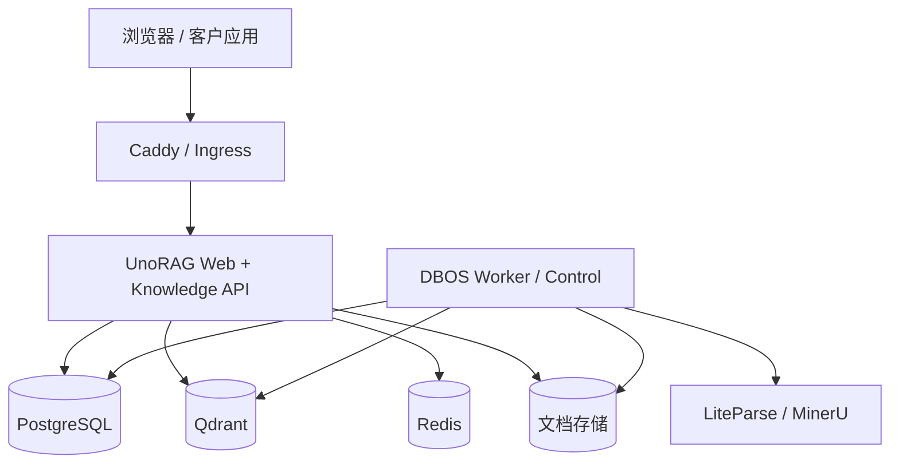

# UnoRAG 私有化部署

UnoRAG 提供两种客户部署入口：Docker Compose 是单机参考拓扑，Helm Chart 是客户托管
Kubernetes 的起点。两者使用相同的四个 Node 镜像和相同的产品数据模型。

## 运行拓扑



公网只暴露 Web。Worker、PostgreSQL、Qdrant、Redis、DBOS 管理端点和 ParserProvider
必须位于客户内网。PostgreSQL `app` schema 是唯一业务事实源，DBOS 使用独立 system database。

## Compose 安装

宿主机需要 Docker、Docker Compose v2 和 Python 3。Python 只用于配置迁移及验收脚本，
四个产品镜像均为 Node 运行时。

```bash
cd deploy/compose
./scripts/init-config.sh
# 编辑 ../config/runtime.env、runtime.secret、bootstrap.env
./scripts/prepare-runtime-db-secrets.sh --bundled-postgres
./scripts/install.sh
```

必要 Secret 包括：

- `POSTGRES_PASSWORD`
- 独立的 `UNORAG_WEB_DB_PASSWORD`、`UNORAG_WORKER_DB_PASSWORD`、`UNORAG_DBOS_DB_PASSWORD`
- 至少 32 字符的 `UNORAG_SESSION_SECRET`
- `LLM_API_KEY`
- 仅用于首次初始化的 `UNORAG_ADMIN_PASSWORD`

外部 PostgreSQL 应由客户创建等价最小权限角色，并分别配置 `WEB_DATABASE_URL`、
`WORKER_DATABASE_URL`、`DBOS_SYSTEM_DATABASE_URL` 与 `MIGRATOR_DATABASE_URL`。
Web 和 Worker 运行身份不得拥有 DDL 权限。

安装程序依次启动基础设施、执行 Drizzle 迁移、配置数据库角色、初始化首个组织、Workspace
和管理员、启动 DBOS、对账 ACL 投影，最后启动 Web 与 Caddy。

如需部署覆盖文件，必须在每次操作中显式选择：

```bash
export UNORAG_COMPOSE_OVERLAY=./docker-compose.customer.yml
./scripts/install.sh
```

同一变量也应供后续升级、备份、恢复和 `mk_compose` 命令使用，避免意外切换拓扑。

## ParserProvider

LiteParse 是 Worker 内的本地快速路径。自托管 MinerU 示例：

```dotenv
MINERU_PROVIDER=self_hosted
MINERU_SELF_HOSTED_URL=http://mineru:6006
MINERU_TRANSPORT=sync
```

MinerU 地址应位于客户批准的信任边界内。选择 302.AI 会把文档上传到客户网络之外，必须
同时开启外部处理开关，且 API Key 只能进入 Worker Secret：

```dotenv
MINERU_PROVIDER=302ai
MINERU_302_BASE_URL=https://api.302.ai
EXTERNAL_PARSER_ALLOWED=true
MINERU_API_KEY=...
```

`local_only` 文库策略始终禁止云端解析。外部处理开关关闭时，路由器不得选择 302.AI。

## 健康检查

```bash
curl -fsS http://localhost/api/rag/health | jq .
source deploy/compose/scripts/compose-env.sh
mk_compose ps
mk_compose --profile ops run --rm inspect-lifecycle
```

| 组件 | 预期 |
|---|---|
| Web | `/api/rag/health` 返回 200，生产配置失败时 fail closed |
| DBOS Worker | 私有 `:3001/dbos-healthz` 正常 |
| DBOS Control | ready marker 持续更新 |
| PostgreSQL | `pg_isready` 正常 |
| Qdrant | 私有 `:6333` ready |
| Redis | `redis-cli ping` 正常 |

## 镜像与升级

发布物包含 `web`、`migrator`、`ops` 和 `worker` 四个镜像。生产只使用 digest-pinned
manifest，禁止使用浮动 `latest`。

```bash
cd deploy/compose
./scripts/backup.sh ./backups/pre-upgrade
./scripts/upgrade.sh --manifest /path/to/release-registry.env
```

升级顺序是：拉取镜像、前向迁移、数据库角色验证、DBOS 滚动、ACL 对账、Web 滚动、
健康检查与冒烟。上一个镜像集合保存在 `.upgrade-state/previous-images.env`。应用升级失败
可以恢复旧镜像，但数据库不会自动向下迁移；破坏性 schema 变化必须设计兼容窗口。

## 备份与恢复

参考 Compose 备份覆盖 PostgreSQL、DBOS、文档对象与 Qdrant。Redis 会话可重建，不属于恢复集。

```bash
./scripts/backup.sh ./backups/$(date +%Y%m%dT%H%M%S)
CONFIRM=YES ./scripts/restore.sh ./backups/<backup-id>
```

恢复顺序固定为：停止应用、恢复 PostgreSQL、恢复文档对象、恢复 Qdrant、启动应用并验证。
恢复后必须检查登录、active version、既有引用、新上传、Retrieve/Ask、删除、生命周期巡检和
跨 Workspace 隔离。只生成备份文件而未做过恢复演练，不算具备恢复能力。

## Kubernetes

Chart 位于 [`deploy/helm/unorag`](../deploy/helm/unorag)，默认使用客户托管的 PostgreSQL、
Qdrant 和 Redis。Helm starter 尚不承诺完整 HPA、PDB、NetworkPolicy 或 S3；这些能力应按
客户基础设施和 [PRODUCT.md](./PRODUCT.md) 的当前边界评估。

详细配置项见 [`deploy/README.md`](../deploy/README.md) 和
[`deploy/helm/README.md`](../deploy/helm/README.md)。上线判定以 [RELEASE.md](./RELEASE.md) 为准。
