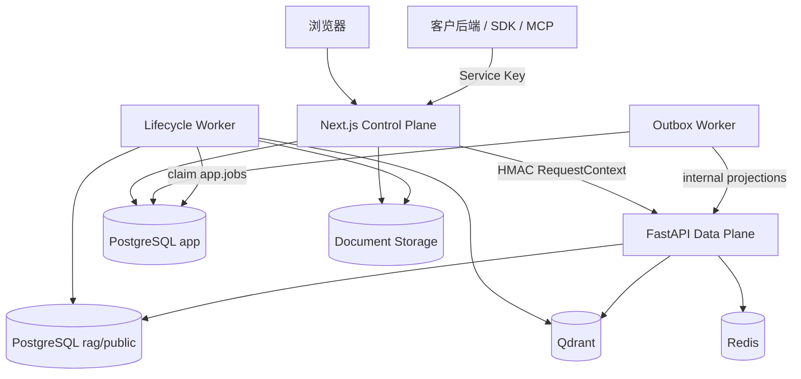
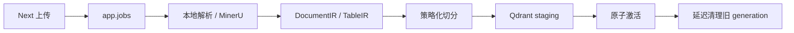
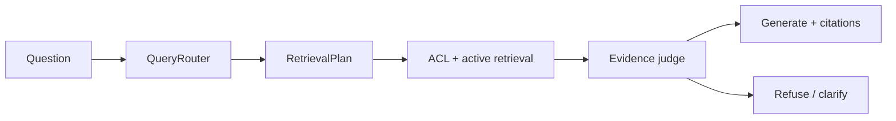

# UnoRAG 接手与仓库维护指南

> 更新：2026-07-29
>
> 目标：让新的开发者在不依赖历史聊天记录的情况下，理解产品边界、代码连接、
> 测试体系和仓库清理规则。

## 15 分钟阅读顺序

1. 根目录 [`README.zh-CN.md`](../README.zh-CN.md)：产品价值和能力概览。
2. [`STATUS.md`](./STATUS.md)：哪些已完成、部分完成、规划中。
3. [`ARCHITECTURE.md`](./ARCHITECTURE.md)：控制面、数据面、入库、检索和 Ask。
4. 本文：代码位置、测试层级、清理规则和交付检查。
5. 要实际启动时再读 [`DEV.md`](./DEV.md) 或
   [`runbooks/private-deployment.md`](./runbooks/private-deployment.md)。

不要从某一份日期验收报告推断当前能力。报告只证明绑定版本和环境，
当前事实以代码、`STATUS.md` 和冻结契约为准。

## 事实源

| 问题 | 权威位置 | 不应作为事实源 |
|---|---|---|
| 产品做什么 | `docs/PRODUCT.md` | 历史规划、聊天记录 |
| 当前做到了什么 | `docs/STATUS.md` | 日期验收报告 |
| 接下来做什么 | `docs/ROADMAP.md` | 已完成的阶段编号 |
| 系统如何连接 | `docs/ARCHITECTURE.md` + ADR | README 中的摘要图 |
| Public Retrieve/Ask 契约 | `docs/contracts/retrieve-ask-v1.md` + OpenAPI | SDK 自己发明的字段 |
| 产品数据 | PostgreSQL `app` schema | Python `public` 兼容投影 |
| 生命周期任务 | `app.jobs` | Redis/ARQ、FastAPI ingest |
| 当前可召回版本 | `app` active pointer + `rag.active_generation` | Qdrant 中任意已写入 point |
| 浏览器身份和权限 | Next.js session + DB membership | 客户端传入 tenant/workspace |
| 检索隔离 | 签名 RequestContext + Qdrant ACL filter | 生成 Prompt 中的权限说明 |

## 仓库地图

```text
UnoRAG/
├── apps/web/       Next.js 控制面、Workspace、Knowledge API、Outbox
├── apps/api/       FastAPI 数据面、LangGraph、解析、索引、Worker、Eval
├── sdk/python/     Retrieve/Ask v1 同步 Python 客户端
├── sdk/mcp/        基于 Python SDK 的 MCP 薄适配
├── deploy/         Compose、Helm、迁移、升级、备份恢复
├── docs/           产品、状态、架构、ADR、runbook、验收证据
├── testdata/       可版本化的真实文件 fixture 与黄金断言
├── contracts/      内部生命周期机器可读契约
└── scripts/        跨应用检查、发布与可重复验收脚本
```

## 运行连接



### 控制面

`apps/web` 拥有：

- organization、user、workspace、membership、group；
- library、document、version、active pointer、ACL；
- lifecycle job 的产品状态；
- audit、Service Key、Workspace ask settings；
- 浏览器 session、安全边界和 Public Knowledge API；
- `app.outbox_events` 及其投影 Worker。

### 数据面

`apps/api` 拥有：

- DocumentIR、TableIR、解析器和 chunk policy；
- embedding、Qdrant payload、active generation 检索门禁；
- QueryRouter、RetrievalPlan、LangGraph Ask；
- hybrid、rerank、table executor、citation、refusal；
- archive/turns 的兼容运行模型；
- lifecycle worker 和 generation cleanup。

### 不变量

1. 浏览器不直连 FastAPI。
2. 产品上传不走 `/v1/ingest*`；这些入口永久返回 410。
3. 未激活 generation 不可召回。
4. 新版本失败时旧 active 继续服务。
5. 所有检索必须带 organization、workspace、library、ACL 和 active generation。
6. SDK/MCP 只调用 HTTP API，不复制权限、数据库或检索实现。

## 两条核心流程

### 文档入库



关键代码：

| 环节 | 位置 |
|---|---|
| Next 文档 API | `apps/web/src/app/api/libraries/` |
| Job payload / enqueue | `apps/web/src/lib/server/document-*` |
| Worker claim / heartbeat | `apps/api/app/lifecycle_worker.py` |
| 解析路由 | `apps/api/app/services/ingest/router.py` |
| MinerU | `apps/api/app/services/ingest/mineru*` |
| IR / TableIR | `apps/api/app/services/ingest/ir.py`、`table_ir.py` |
| 切分 | `apps/api/app/services/ingest/chunker.py` |
| 激活 / cleanup | `apps/api/app/workers/`、`repositories/job_repository.py` |

### Ask



关键代码：

| 环节 | 位置 |
|---|---|
| BFF / RequestContext | `apps/web/src/app/api/rag/`、`internal-rag-context.ts` |
| Ask 图 | `apps/api/app/graph/` |
| Query route | `apps/api/app/services/query_router.py`、`ask_route.py` |
| Retrieval | `apps/api/app/services/retrieval.py`、`qdrant_store.py` |
| ACL filter | `apps/api/app/security/access_scope.py` |
| Table executor | `apps/api/app/services/table_query.py` |
| Citation / refusal | `apps/api/app/services/citation_*`、`answer_copy.py` |

## 测试体系

### 代码测试

| 层 | 位置 | 重点 |
|---|---|---|
| API 单元/特征测试 | `apps/api/tests/test_*.py` | RAG、权限、生命周期、解析 |
| Eval | `apps/api/tests/eval/` | 黄金集、release gate、消融 |
| PostgreSQL 集成 | `test_job_repository_postgres.py` | claim、激活、cleanup 与 SQL |
| Web | `apps/web/tests/*.test.mjs` | 权限、事务、API、UI 契约、Outbox |
| Web PostgreSQL | `outbox-postgres.test.mjs` | claim 顺序、dead replay、竞态 |
| SDK | `sdk/python/tests/` | 请求、模型和错误映射 |
| MCP | `sdk/mcp/tests/` | 工具输入输出和错误映射 |

`phase2b`、`phase2c` 等文件名是历史阶段名，内容仍有效。除非同时重构测试分类和
引用，不要仅为“看起来新”批量改名。

### 真实 fixture

| 目录 | 用途 |
|---|---|
| `testdata/md`、`txt` | 标题、叙事与普通文本 |
| `testdata/pdf` | 数字 PDF、扫描件、页眉页脚、图文 |
| `testdata/docx` | 标题层级和原生表格 |
| `testdata/csv` | 原生结构化表格 |
| `testdata/ab` | 双栏、复杂表、图表、低对比扫描、长叙事 |
| `testdata/unsupported` | 当前产品明确拒收的格式 |

fixture 规则：

1. 每个文件有跨文件唯一锚点，避免误命中也能通过。
2. 正例必须放在实际格式目录，不能因为历史原因留在 `unsupported`。
3. 生成文件的脚本与结果分开；生成结果不提交。
4. 新解析格式至少增加一个真实 fixture 和一个 `ingest_chunk` 或 `ingest_http` case。
5. 修改 fixture 内容时同步检查黄金断言和验收报告中的引用。

### 提交前门禁

```bash
# API + deterministic RAG gate
cd apps/api
uv run pytest
uv run python scripts/run_release_gates.py

# Web
cd ../web
pnpm test
pnpm lint
pnpm db:check
pnpm build

# 仓库级
cd ../..
python3 scripts/compare_policy_parity.py
./scripts/check_brand_residue.sh
git diff --check
```

需要真实 PostgreSQL 的用例：

```bash
cd apps/web
OUTBOX_TEST_DATABASE_URL=postgresql://... pnpm test:postgres
```

API PostgreSQL 测试按测试文件中的环境变量说明配置。SKIP 不是 PASS；发布报告应分别
记录通过、跳过和目标环境中的替代证据。

## 文档维护规则

| 类型 | 位置 | 更新规则 |
|---|---|---|
| 产品入口 | 根 README | 只讲价值、能力、架构摘要和诚实边界 |
| 当前事实 | `STATUS.md` | 功能状态变化时必须更新 |
| 目标顺序 | `ROADMAP.md` | 只放未完成工作，不复述完整历史 |
| 技术设计 | `ARCHITECTURE.md` | 代码所有权、数据流或不变量变化时更新 |
| 决策 | `docs/adr/` | 重要不可逆决策新增 ADR，不改写历史动机 |
| 操作步骤 | `docs/runbooks/` | 必须可执行，不放产品宣传 |
| 验收证据 | `docs/acceptance/reports/` | 日期 + 环境 + commit；写明 PASS/FAIL/SKIP |

历史报告不删除，也不回写成当前状态。数量明显增长后按月份移动到
`docs/acceptance/reports/archive/YYYY-MM/`，同时更新索引和相对链接。

## 清理规则

### 可安全清除的本地产物

这些目录均被 `.gitignore` 排除，不是产品证据的唯一副本：

```text
.pytest_cache/
**/__pycache__/
apps/api/.eval_reports/
testdata/ab/_e2e_out/
apps/web/.next/
```

先预览，再按目录删除：

```bash
git status --ignored --short
du -sh .pytest_cache apps/api/.eval_reports testdata/ab/_e2e_out 2>/dev/null
```

不要用 `git clean -fdx`，它会连本地 `.env`、模型密钥、数据库配置和虚拟环境一起删掉。

### 应保留

- Drizzle migration SQL、`meta/_journal.json` 和 snapshots；
- `contracts/`、Public OpenAPI 和 eval baselines；
- `testdata/` 中真实 fixture 与生成脚本；
- ADR 和绑定 commit/环境的验收报告；
- backup/restore、故障注入和隔离脚本；
- `.env.example`、runtime example 和 Secret 名称模板。

### 需要定期审查

- README 是否把规划能力写成已实现；
- `STATUS.md` 与代码是否一致；
- `testdata/unsupported` 是否混入后来已经支持的格式；
- `.eval_reports` / `_e2e_out` 是否积累过多；
- 日期报告是否应按月份归档；
- 旧兼容入口、env 和品牌名称是否已经满足删除条件；
- CI 是否验证所有实际发布镜像和进程。

## 常见改动从哪里开始

| 需求 | 先读 | 同时检查 |
|---|---|---|
| 新文件格式 | parser router + IR | fixture、eval、MIME、Web upload、README |
| 新 chunk policy | ADR-0003 + chunker | payload version、reindex、parity、AB eval |
| 新 Ask 路径 | graph + router | trace、archive、拒答、黄金集 |
| 新权限 | `app` schema + RequestContext | Qdrant filter、IDOR、跨 Workspace fuse |
| 文档 replace/delete | Next lifecycle API | desired version、active generation、cleanup |
| 新 Public API | contract + Next gateway | Service Key scope、audit、OpenAPI、SDK/MCP |
| 新部署进程 | Compose + Helm | CI build、release manifest、health、backup |

## 当前最高优先级

以 `STATUS.md` 和 `ROADMAP.md` 为准，当前主要缺口是：

1. Public Documents / Versions / Jobs API；
2. 一个真实可验收的 OIDC Provider；
3. S3/MinIO 一等对象存储；
4. 目标客户规格上的容量与并发基线；
5. Helm HPA/PDB/NetworkPolicy、SBOM 与镜像签名；
6. Workspace rename/archive/delete、用户组管理和反馈闭环。

不要在这些交付边界之前扩张成开放 Agent 平台，也不要让 SDK、MCP 或其他框架拥有
第二套权限、版本和检索事实。

## 接手第一天检查

```bash
git status -sb
git log --oneline -12
git diff origin/main..HEAD --stat
```

然后：

1. 确认本地分支与远端差异，避免遗漏未推送提交。
2. 阅读 `STATUS.md` 的“最高优先级缺口”。
3. 跑不需要外部服务的完整测试。
4. 检查 `apps/web/.env.example`、`apps/api/.env.example`，不要复制生产密钥。
5. 需要部署时使用 `deploy/compose` 或 Helm，不把根目录开发 Compose 当客户拓扑。
6. 修改前确认 schema 和服务所有权，避免在 Next 与 Python 各建一份事实。
