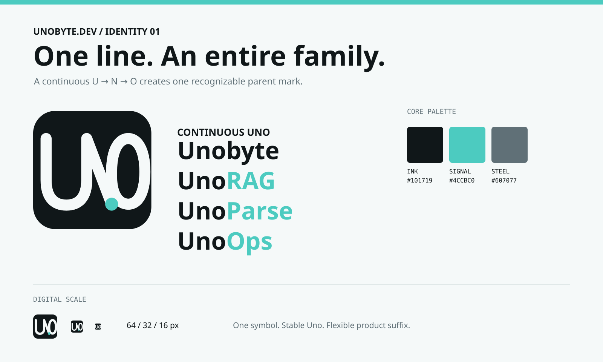

# Uno 品牌系统

> 状态：**临时资产，尚未定稿。** 当前 SVG、favicon 与产品界面使用本方案以保持品牌一致，稳定版发布前仍需
> 完成视觉定稿、产品截图更新和目标法域商标检索。名称与素材的对外使用规则见
> [商标使用政策](../../TRADEMARKS.md)；本文不是不可变的品牌承诺。

Uno 是 Unobyte.dev 及其产品的母品牌。核心符号不是一个孤立的 `U`，而是一条连续路径依次形成
`U → N → O`。它直接把名称写进轮廓，在小尺寸仍可辨认，也避开常见的 AI 星芒、节点网络和像素化
字母语言。

## 品牌架构

| 层级 | 命名 | 用法 |
|---|---|---|
| 母品牌 | Unobyte | 官网、团队与组织身份 |
| 产品 | UnoRAG | 企业知识产品 |
| 产品 | UnoParse | 文档解析能力（预留） |
| 产品 | UnoOps | 运维与可观测能力（预留） |
| 产品 | UnoEval | 评测能力（预留） |

所有产品使用同一个 Uno 图形，不为后缀重新设计图标。文字标识保持 `Uno` 不变，仅用 Signal 色强调
产品后缀。这样产品数量增长时，识别资产仍然只积累在一个符号上。

## 视觉语言

| Token | 色值 | 用途 |
|---|---|---|
| Ink | `#101719` | 标志底色、主要文字 |
| Paper | `#F5F9F9` | 标志线条、浅色背景 |
| Signal | `#4CCBC0` | 路径原点、产品后缀、交互强调 |
| Steel | `#607077` | 次要文字与说明 |

- 图形中的 Signal 点位于 `N/O` 的转换位置，表达一条能力路径继续进入下一个产品。
- 字标优先使用 IBM Plex Sans；技术标签和版本信息使用 IBM Plex Mono。
- 不使用负字距、渐变、外发光、阴影、星芒或额外网络节点。

## 尺寸与留白

- `16px` 是数字界面的最小尺寸；低于 `24px` 时只使用图形，不并排放置字标。
- 图形四周至少保留图标宽度 `1/4` 的留白。
- 圆角方形是图形本体的一部分，不再套第二层装饰容器。
- 不改变路径比例、线宽、颜色关系或 Signal 点位置。

## 文件与组件

- `public/brand/uno-mark.svg` 是唯一矢量主源。
- `uno-mark.png`、favicon 和 Apple touch icon 都从该主源生成。
- `UnoLogo` 接受产品后缀；`UnoRAGLogo` 是当前产品的兼容封装。

## 权属提醒

该图形为项目内原创矢量方案，未嵌入第三方图形素材。视觉原创不等于商标可注册：公开发布前仍应对
`Unobyte`、`Uno` 和具体产品名在目标国家、地区及软件相关类别完成正式检索与法律确认。
商标政策已经明确开源许可之外的当前使用边界，但不替代该检索与法律确认。
