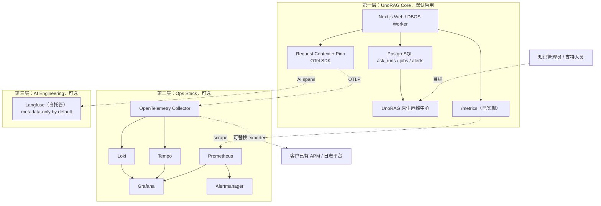

# UnoRAG 可观测性目标架构

> 状态：核心诊断、原生运行中心、OpenTelemetry SDK、Compose Ops Stack、基础指标、组件健康、
> 持久告警及可选 Webhook/邮件投递已实现；Langfuse 仍是后续交付；
> 本文件同时标明当前能力和目标边界。
>
> 关联：[产品说明](../PRODUCT.md) · [架构](../ARCHITECTURE.md) · [运维指南](../OPERATIONS.md) · [混合检索设计](./hybrid-retrieval.md)

## 1. 产品背景与目标

UnoRAG 面向需要私有化知识库、但通常没有独立 AI 平台或 SRE 团队的中小企业，以及为这些客户
交付系统的集成商。可观测性首先要让知识管理员和普通运维人员在 UnoRAG 内看懂问题，而不是要求
客户先学会 PromQL、Tempo 或 Langfuse。

目标是建立三层能力：

1. **核心原生层**随标准版交付并始终可用，保证系统不依赖外部观测组件也能诊断。
2. **Ops 增强层**作为官方维护的可选部署包，为专业运维提供集中日志、指标、Trace 和告警。
3. **AI 工程层**按需启用自托管 Langfuse，为调优团队提供模型、Prompt、成本和评测能力。

三层共享请求上下文和 OpenTelemetry 语义，但相互不构成运行依赖。任何观测组件故障都不得阻塞
Ask、入库、检索或生命周期任务。

## 2. 当前基线

以下能力已经存在，应在其上演进，而不是重写：

| 能力 | 当前状态 |
|---|---|
| 管理操作审计 | `app.audit_logs` 已持久化关键管理操作，并支持分页查询和导出 |
| Ask 业务调试信息 | `AskState` 已承载 `retrieval_debug`、`judgement`、`table_execution` 和业务 `trace_id` |
| Ask 调试界面 | `AskTraceDrawer` 能展示调试 JSON，并预留 `stages` 时间线 |
| 归档会话调试信息 | 归档后相关调试字段随 `app.turns.debug` 保存 |
| 解析诊断 | `parser_report` 已记录 ParserProvider、降级原因和部分质量指标 |
| 生命周期诊断 | 产品 Job、DBOS workflow、进度、重试和取消已有业务状态 |
| 关联上下文与日志 | Browser/Public API 和 DBOS workflow 已接入 AsyncLocalStorage、Pino JSON 与 OTel SDK |
| Ask 执行记录 | `app.ask_runs` 已通过 `0021_ask_runs.sql` 落地隐私安全的开始/终态元数据 |
| 运行健康与告警 | `0022_easy_synch.sql` 已落地作用域健康快照、告警状态机、不可变转换和持久投递记录 |

TypeScript Ask 主路径现已生成实际执行节点、Token 生成、持久化的 `retrieval_debug.stages` 和
`total_duration_ms`。当前粒度覆盖路由、计划、重写、检索、裁决、表格路径、生成准备、真实生成和
持久化；OTel Span 进一步覆盖 Ask、Retrieve、生成、结构化输出、Embedding、Rerank 与 Qdrant 边界。
dense/lexical、fusion 等检索内部子阶段仍可按实际调优需要继续细分。

当前已有核心路径 Pino JSON、上下文传播、低基数 Prometheus 指标、原生运行中心和产品告警。
OpenTelemetry 默认关闭并 fail-soft；Compose 可显式启用 Collector、Prometheus、Grafana、Loki、
Tempo 与 Alertmanager。Kubernetes Chart 只提供到客户托管 Collector 的标准 OTLP 接口，不替客户
安装第二套监控平台。

## 3. 三层架构



### 3.1 第一层：核心原生能力

第一层属于标准版产品能力，默认启用且不能依赖 Grafana 或 Langfuse。

#### Ask 调试契约

保留现有响应和归档中的业务调试字段。当前稳定阶段包括：

```text
route -> plan -> rewrite -> retrieve -> judge -> prepare_generate
      -> generate -> persist
```

表格、澄清、拒答和重试路径按实际执行追加阶段。下一步再把 `retrieve` 拆成以下 Provider 子阶段：

```text
route -> rewrite -> embed -> dense_retrieve -> lexical_retrieve
      -> fusion -> rerank -> judge -> table_execute -> generate -> persist
```

阶段可以因路由或降级而缺席；每个实际执行的阶段记录 `stage`、`duration_ms` 和 `ok`。未来新增的
`detail` 只能包含经过允许列表投影的诊断元数据。这份 JSON 是稳定、租户隔离、面向产品支持的诊断
契约，不由 OTel 或 Langfuse 替代。
公共 Retrieve/Ask v1 契约仍不得返回内部 `retrieval_debug`。

#### `app.ask_runs`

`app.ask_runs` 只保存诊断元数据，不命名为 `ask_traces`，以免和分布式 Trace 混淆。当前模型由
`0021_ask_runs.sql` 固化：

```text
id                  uuid primary key
request_id          uuid, stable business correlation id
otel_trace_id       varchar(32), nullable
organization_id     uuid
workspace_id        uuid
library_id          uuid
rag_library_id      varchar(128)
principal_type      user | service_key
user_id             uuid, nullable
service_key_id      uuid, nullable
thread_id           uuid, nullable
query_type          varchar(32)
retrieval_mode      varchar(32)
status              running | completed | refused | failed | cancelled
refuse_reason       varchar(128), nullable
used_hybrid         boolean
used_rerank         boolean
citation_count      integer
latency_ms           integer, nullable
error_code          varchar(128), nullable
started_at          timestamptz
ended_at            timestamptz, nullable
```

流式 Ask 开始时插入 `running`，正常结束、拒答、取消或失败后更新终态。不得用无法等待的“异步
fail-soft 写入”制造不可知的数据丢失；写入失败应有结构化错误和指标，但观测表故障仍不得改变 Ask
业务结果。

默认不保存问题、回答、Prompt、引用正文和完整检索块。当前 repository 支持按组织、Workspace 和时间
范围批量删除终态记录；按用户删除、配置化调度和 stale-running 收敛已由 Phase 1B 补齐。临时会话被
归档时可以回填 `thread_id`，但 `ask_runs` 不是会话内容存储。

#### 原生运维中心

原生界面应以行动为导向，至少提供：

- Ask 请求量、成功率、拒答率、P50/P95、无引用回答和最近错误；
- Parser、Embedding、Rerank、LLM Provider 的健康、延迟和错误分类；
- DBOS queued/running/dead/stuck、最老等待时间、重试和取消结果；
- 文档解析、索引、替换、删除和 generation cleanup 的进度与失败原因；
- PostgreSQL、Redis、Qdrant、对象/文档卷和磁盘的基础健康状态；
- 按 `request_id`、`job_id`、`workflow_id` 搜索诊断上下文；
- 邮件或 Webhook 基础告警，以及明确的恢复建议。

核心应用已经输出 Pino JSON 和低基数 `/metrics`，让客户不启用官方 Ops Stack 也能接入已有系统。
当前运行中心覆盖 Ask、任务队列、dead/stuck、最近错误、PostgreSQL/Redis/Qdrant 主动探测，以及
LLM、Embedding、Rerank、LiteParse、MinerU 配置健康。LLM 等付费 Provider 不做周期真实调用；真实调用
错误仍由 Ask/Job 诊断反映。告警 open、连续两轮健康后的 resolved、reopen 和投递均持久化，转换与投递
快照在同一事务生成；Webhook 使用稳定事件 ID 与 HMAC，邮件使用 Resend 幂等键。投递超时、退避和
最终失败只改变诊断状态，不阻塞 Ask、检索、入库或生命周期任务。

### 3.2 第二层：可选 Ops Stack

Ops Stack 随官方部署包提供，但不默认启动，适合有运维团队、多实例、SLA 或长期日志需求的客户：

- OpenTelemetry Collector：统一接收、处理、采样和导出；
- Prometheus + Grafana：指标、看板和容量趋势；
- Loki：集中 UnoRAG 结构化应用事件（全容器 stdout 由部署方日志采集器负责）；
- Tempo：跨 Web、Worker、Provider、Qdrant 等组件的分布式 Trace；
- Alertmanager：细粒度告警、抑制、分组和升级。

Compose 部署接口：

```bash
./scripts/install.sh --with-observability
```

该模式只把 Grafana 绑定到宿主机回环地址；Collector、Prometheus、Loki、Tempo 和 Alertmanager
不发布宿主机端口。Prometheus 从容器内抓取 `/metrics`，Caddy 对公网 `/metrics` 与
`/api/metrics` 返回 404。默认采样率为 10%，日志 7 天、Trace 72 小时、指标 15 天，均可通过部署
配置调整。Alertmanager 默认使用本地空 receiver，避免和 UnoRAG 原生 Webhook/邮件告警重复投递。

客户已有 ELK、Splunk、Datadog 或公司级 OTel 平台时，应允许只配置 Collector exporter，不要求重复
部署本地全家桶。Ops 数据采用有限保留、采样及进程 CPU/内存上限；Docker 命名卷不提供磁盘硬配额，
生产必须置于有容量告警和配额控制的文件系统，或改用客户托管存储。Grafana 不直接暴露公网，观测
存储故障不得影响核心服务。

### 3.3 第三层：可选 Langfuse

Langfuse 面向 UnoRAG 开发、实施和模型调优团队，负责：

- LangGraph 节点、路由、检索和裁决的语义追踪；
- Vercel AI SDK 模型调用、首 Token 延迟、Token 与成本；
- Prompt 版本、用户反馈、在线评分、数据集和实验比较；
- 将仓库现有黄金集作为事实源导入实验，而不是另建一套互相漂移的测试数据。

仅接 LangGraph callback 不足以覆盖真实模型调用；实现时还要对 Vercel AI SDK、Embedding、Rerank、
ParserProvider 和 Qdrant 建立 OTel/SDK 埋点。

Langfuse 默认采用 **metadata-only**：

```text
LANGFUSE_CAPTURE_CONTENT=false
LANGFUSE_SAMPLE_RATE=0.10
LANGFUSE_RETENTION_DAYS=30
```

默认只记录模型、耗时、Token、路由、错误码和脱敏元数据，不记录问题、回答、Prompt、引用正文或检索块。
采集内容必须由管理员按 Workspace 明确开启，同时配置角色权限、脱敏、采样、保留期和删除机制。
自托管不等于可以绕过 UnoRAG 的临时会话隐私承诺。

Langfuse 依赖的 Web、Worker、ClickHouse、Redis、对象存储等组件不应增加标准版的安装和备份负担。

## 4. 标识与上下文模型

业务关联标识和 OTel Trace ID 必须分离：

| 标识 | 格式与生命周期 | 用途 |
|---|---|---|
| `request_id` | UUID；一次外部请求稳定不变 | 对外返回、客服报障、业务日志关联 |
| `otel_trace_id` | W3C 32 位十六进制；一次同步执行 | 在 Tempo/Langfuse/APM 查询本次分布式 Trace |
| `job_id` | UUID；产品任务生命周期 | 用户可见的入库、删除、重索引等任务 |
| `workflow_id` | DBOS 稳定工作流标识 | 重试、恢复、幂等和持久执行关联 |
| `attempt_trace_id` | 每次 Worker 执行/恢复独立 OTel Trace | 分析单次执行尝试的耗时和错误 |

为保持 Retrieve/Ask v1 兼容，公共响应现有的 `trace_id` 字段继续作为 `request_id` 的兼容别名，值仍是
UUID；它不得在不升级 API 版本的情况下改成 `otel_trace_id`。产品界面可同时展示“请求 ID”和仅在
OTel 启用后出现的“分布式 Trace ID”。

Ask 链路：

```text
request_id -> otel_trace_id -> route/retrieve/judge/generate spans
```

异步生命周期：

```text
上传 request trace -> enqueue span
                         -- Span Link --> worker attempt trace
                                           -> parse/chunk/embed/index/activate
```

DBOS 排队可能持续很久，任务也可能重试或恢复，因此不得构造跨越数小时或数天的单一父子 Trace。
每次 attempt 使用新 Trace，通过 OTel **Span Link** 关联创建请求，并通过 `job_id`/`workflow_id` 关联
业务生命周期。日志和指标携带这些标识，但不得把 organization、workspace、document、request 等高基数
字段作为 Prometheus label；它们属于日志或 Trace attribute。

## 5. 数据安全与保留

1. 日志、指标和 Trace 默认不包含问题、回答、Prompt、引用正文、文档正文、密钥或认证头。
2. 所有查询、原生看板和导出都必须强制 organization、workspace 与角色范围，支持人员不能绕过 ACL。
3. `request_id` 等关联标识不应成为授权凭证；仅凭一个 ID 不能读取其他租户诊断数据。
4. Prometheus 标签必须保持低基数；租户和资源维度进入结构化日志、Trace 或受控数据库聚合。
5. 默认保留期应有限，并为日志、Trace、指标、`ask_runs` 和 Langfuse 分别配置。
6. 观测数据与业务备份分开定义；可重建的短期观测数据不应无意扩大客户 RPO/RTO。
7. 导出到客户外部平台前必须经过 Collector 脱敏和允许列表处理。

## 6. 版本与商业边界

| 交付形态 | 默认状态 | 目标用户 | 完整目标能力 |
|---|---|---|---|
| UnoRAG 标准版 | 默认启用 | 中小企业 | 原生运维中心、`ask_runs`、Pino JSON、`/metrics`、基础告警和标准 OTLP 接口 |
| UnoRAG Ops | 选装 | 中型企业、集成商、运维团队 | Collector、Prometheus/Grafana、Loki/Tempo、Alertmanager 与预置规则 |
| AI 工程增强 | 选装 | 调优与实施团队 | 自托管 Langfuse、评测、Prompt、模型成本和实验工作流 |
| 外部平台接入 | 按需配置 | 已有监控体系的客户 | OTLP、Prometheus、Webhook 和 Collector exporter |

标准版必须独立可诊断；商业价值来自生产验证过的部署、看板、告警、保留策略、AI 质量闭环、升级支持
和 SLA，而不是隐藏开放标准或让社区版成为不可运维的演示品。

## 7. 实施顺序与验收

### Phase 1A：核心诊断基础（已实现）

- 统一 Request Context 和 Pino JSON schema；
- 明确 `request_id`、`otel_trace_id`、`job_id`、`workflow_id` 契约；
- 为 Ask 主路径产生真实 stages 和总耗时；
- 建立 `app.ask_runs` 的开始/终态写入、批量保留删除和数据库租户约束；

验收：核心单元和数据库约束测试覆盖 ID 传播、日志脱敏、成功/拒答/失败终态、跨 Workspace 外键拒绝
和保留删除；观测写失败不改变 Ask 业务结果。

### Phase 1B：原生运维闭环（已实现）

- 已实现管理员原生运行中心、组件健康和持久告警状态机；
- 已暴露低基数 `/metrics`；
- 已增加 stale-running sweeper、按用户删除和正式保留调度；
- 已提供默认关闭的持久 Webhook/邮件投递、去重、lease、退避和恢复通知；
- Provider 真实调用的被动时间序列与按 ID 搜索仍归入 Phase 2 的 Trace/集中日志能力。

验收：不部署任何外部观测组件，也能定位一次 Ask、一次失败入库和一个 dead/stuck workflow；公共 API
不泄漏内部调试信息；跨 Workspace 诊断数据零泄漏。

### Phase 2A：标准 Ops（已实现）

- 接入 OTel SDK 和 Collector；
- 打通 Web、DBOS Worker、Provider、Qdrant 的 Span；异步 enqueue 到 attempt 的显式 Span Link
  仍可在后续增强；
- 提供 Prometheus/Grafana、Loki/Tempo、Alertmanager 可选部署包；
- 提供进程资源限制、采样、保留、认证和外部 exporter 配置；磁盘配额由部署基础设施负责。

验收：Compose/Helm 配置契约、隐私 allowlist、内部网络、回环 Grafana、独立 exporter 开关均已有
自动化测试；部署级验收已实际启动隔离组件、写入并按同一 Trace ID 反查 Tempo/Loki、查询 Prometheus，
并验证停用 Ops 后两套既有核心环境继续健康。正式发布仍需在目标部署环境重复该 smoke。

### Phase 3：AI 工程增强

- 接入自托管 Langfuse，默认 metadata-only；
- 覆盖 LangGraph 与 Vercel AI SDK 的模型/Token/成本语义；
- 导入现有黄金集，建立版本化 Prompt 和模型实验；
- 验证内容采集开关、删除、权限和保留策略。

验收：关闭内容采集时 Langfuse 中不存在问题、回答和文档正文；开启时必须有明确的 Workspace 管理动作
和审计记录；Langfuse 不可用不影响 Ask。

## 8. 非目标

- 不用 Langfuse 替代 UnoRAG 原生运维中心或 Ask 调试 JSON；
- 不把 Grafana、Tempo、Loki 或 Langfuse 变成核心请求依赖；
- 不以单一 `trace_id` 强行覆盖业务请求和持久工作流的所有生命周期；
- 不在本设计中决定 BM25 缓存或 Qdrant sparse 迁移，相关问题见
  [混合检索设计](./hybrid-retrieval.md)；
- 不因观测需要改变公共 Retrieve/Ask v1 的安全投影和临时会话语义。
