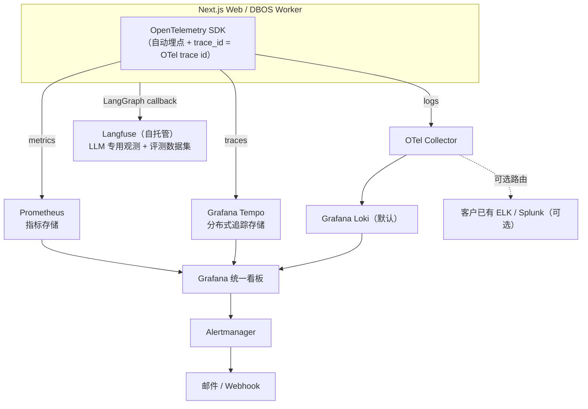

# UnoRAG 可观测性目标架构

> 状态：设计提案（尚未实现，待评审通过后拆入 [OPERATIONS.md](../OPERATIONS.md)）
>
> 关联：[架构](../ARCHITECTURE.md) · [运维指南](../OPERATIONS.md) · [产品说明](../PRODUCT.md)

## 0. 背景

UnoRAG 首先是私有化部署产品（见 [PRODUCT.md](../PRODUCT.md)），观测体系必须能在客户内网自托管，
不能依赖任何公网 SaaS APM。当前仓库里没有任何 OpenTelemetry / Prometheus / 结构化日志依赖
（`package.json` 未引入，`deploy/compose` 未包含任何监控组件），基本是一张白纸；`src/db/pool-observability.ts`
新增了一处对 Postgres 连接池 `error` 事件的 JSON 输出，是唯一的雏形，覆盖面极窄，不构成体系。

已经存在、不需要重做的能力：

| 能力 | 位置 | 说明 |
|---|---|---|
| 管理操作审计日志 | `app.audit_logs` 表，`src/lib/server/workspace-audit-db.ts` | 文档上传/删除/重索引/版本/ACL、Service Key、Job 重试/取消等十余处关键操作，已持久化 + 分页查询 + `/api/workspace/audit/export` 导出 |
| Ask 链路调试信息 | `AskState.retrieval_debug` / `judgement`，`src/components/app/ask-trace-drawer.tsx` | 每次 Ask 生成 `trace_id`，前端有 stages 时间线可视化面板 |
| 归档会话的调试落库 | `app.turns.debug`（jsonb） | 会话被主动归档后，`retrieval_debug`/`judgement`/`table_execution` 会随 turn 落库 |

> 此前仓库里还有一个最小告警脚本 `ops/min_alerts/`（5 信号 cron 巡检 + 邮件/webhook），已在
> 2026-08-04 的仓库清理（`chore(repo): remove retired integration surfaces`）中被移除。下文
> "告警"这一支柱不再是"补强现有方案"，而是**完全从零建**，落地优先级也据此调整（见 §5）。

本文档要解决的是这些能力之外的空白：**没有结构化日志、没有指标、没有分布式追踪、没有 LLM
专用观测、没有告警、临时会话没有可追溯记录**。

## 1. 设计原则

1. **只用可自托管的开源组件**，不接受任何组件把客户数据发到外部 SaaS。
2. **默认要轻，加码要容易**：大多数客户是单机 Compose 部署，观测栈做成可选 profile，不强制捆绑。
3. **一个 trace_id 贯穿到底**：业务语义的 `trace_id`（Ask 链路、ingest 链路）与分布式追踪的
   trace id 必须是同一个值，不能有两套互相查不到的编号体系。
4. **LLM 观测与传统 APM 分离建设**：传统 APM 回答"这次请求哪里慢"，LLM 观测要回答"这次检索召回
   对不对、judge 拒答的理由合不合理、这轮问答花了多少 token"——两者工具不同，不能互相替代。
5. **不违反"默认临时"的隐私承诺**：`PRODUCT.md` 明确会话默认临时、不强制入库；观测能力的落地
   不能变相把这条产品承诺破坏掉（见附录 B）。

## 2. 目标架构



### 2.1 四个支柱 + 一个统一入口

| 支柱 | 组件 | 解决什么问题 |
|---|---|---|
| LLM/Agent 观测 | **Langfuse**（自托管） | ask-graph 逐节点可视化、token/成本统计、评测数据集沉淀 |
| 日志 | **pino**（应用侧结构化输出）+ **Loki**（默认）/ 可路由到客户已有 ELK | 排障用的结构化文本记录 |
| 指标 | **Prometheus + Grafana**，配 DBOS/Redis/Qdrant/Postgres exporter | 队列深度、依赖组件健康度、检索延迟分布 |
| 分布式追踪 | **OpenTelemetry SDK + Grafana Tempo** | 一次请求跨 Web/Worker/DBOS/Qdrant/模型调用的全链路 |
| 告警 | **Alertmanager**（细粒度规则，基于 Prometheus 指标） | `ops/min_alerts` 已被移除，无兜底方案可复用，需完整建设 |

### 2.2 具体选型理由

- **Langfuse**：原生支持 LangChain/LangGraph.js 的 callback handler，`ask-graph` 已是 LangGraph.js
  实现，接入成本低；自带评测数据集功能，可以直接用于重建评测语料（`eval/reference` 已在仓库清理中
  被清空，评测数据集本质上是从零搭建，不是"迁移"）；自带 token/成本看板，是"用量配额"能力的可观测前提。
- **Loki 而非默认上 ELK**：Loki 只索引标签不做全文倒排，资源占用远低于 Elasticsearch，适合单机
  Compose 场景；同时和 Grafana/Tempo/Prometheus 是一套生态，能在同一个面板里从日志跳到 trace。
  如果客户已有 ELK/Splunk，通过 **OTel Collector 的 exporter 配置**切换目标即可，不改业务代码。
- **Prometheus + Grafana**：事实标准，Helm/Compose 生态成熟，社区 exporter 覆盖 Postgres/Redis/
  Qdrant，落地成本最低。
- **Tempo**：与 Loki/Grafana 同厂商，部署形态一致（对象存储后端，单机可用本地盘），比 Jaeger 更
  贴合"轻量 + 与日志/指标联动"的目标。

## 3. 部署形态：可选 profile,不强制捆绑

```text
deploy/compose/
  docker-compose.yml                # 现有核心服务（web / worker / pg / qdrant / redis）
  docker-compose.observability.yml  # 新增可选：prometheus + grafana + loki + tempo + langfuse
```

`install.sh --with-observability` 才拉起观测栈。对应到商业化上，可以做成"标准版 / 企业版"的
分层卖点：企业版含开箱即用的可观测性套件，是可交付、可验收的实物，不是空承诺。

## 4. 统一 trace_id 策略

当前 `ask-graph`（`src/core/ask-graph/state.ts`）的 `trace_id` 是业务代码里 `randomUUID()`
生成的，只在 Ask 调用内部有意义，和分布式追踪无关。目标改法：

1. 在请求入口（Next.js middleware / API route）读取或生成 **W3C `traceparent`**，Web 与 Worker
   两侧都接 OpenTelemetry SDK，让"上传 → DBOS 排队 → 解析 → 切分 → 索引 → 激活"和"提问 → 路由 →
   检索 → 判定 → 生成"两条链路都能在 Tempo 里用同一个 trace id 串起来。
2. `AskGraphInput.trace_id` 直接复用这个 OTel trace id，而不是另外生成一个——前端
   `AskTraceDrawer` 的"复制 trace_id"动作，支持人员拿去就能在 Tempo/Langfuse 里查到完整调用链。
3. `app.turns.debug` 里继续保留业务语义的调试字段（`retrieval_debug`/`judgement` 等），但增加
   `trace_id` 作为可查询的顶层字段（而不只是嵌在 jsonb 内部），便于跨表关联。

## 5. 落地优先级

| 顺序 | 内容 | 理由 |
|---|---|---|
| 1 | Web/Worker 接 `pino` 结构化日志，统一 `traceparent` 透传 | 成本最低，替换掉散落的 `console.error`，是后续所有观测的地基 |
| 2 | 接 Langfuse（LangGraph callback） | 投入产出比最高，直接服务于问答质量排障和 eval 数据集重建 |
| 3 | Prometheus + Grafana + DBOS/Redis/Qdrant exporter | 补上后台任务和依赖组件的黑盒问题 |
| 4 | Loki/Tempo 接入，trace_id 与 OTel trace 统一 | 前三项稳定后再做全链路串联 |
| 5 | Alertmanager 细粒度规则（无历史脚本可降级为兜底，需完整建设） | 建立在前面指标都有了的基础上 |

---

## 附录 A：混合检索（BM25 + RRF）性能优化方案

### A.1 现状问题

`src/core/retrieval/retrieval-service.ts` 中，只要开启 hybrid，**每一次查询**都会：

1. 从 Qdrant `scroll` 出整个 library 最多 `corpusLimit`（默认 10,000）个点（`listCorpus`）；
2. 在 Node.js 请求处理进程里，用 `src/core/retrieval/hybrid/bm25.ts` **现场重建一遍 BM25
   倒排索引**（分词、词频、IDF 全部重算）；
3. 再和稠密检索结果做 RRF 融合。

问题：文库越大、QPS 越高，单次查询的延迟和 CPU 开销越高，且没有任何缓存，无法横向扩展。

### A.2 短期方案（低风险，可立即做）：按 active generation 缓存 BM25 索引

关键洞察：一个 library 的检索语料，只有在 **active generation 发生原子切换**时才会变化（这正是
`document-ingest-workflow` 里 `setGenerationVisibility` 的显式事件）。切换之间，语料是不可变的，
天然适合缓存。

- 缓存 key：`(library_id, active_generation_ids 排序后的哈希)`。
- 缓存内容：已经分词、统计好词频/IDF 的 `Bm25Index` 实例。
- 失效时机：`document-ingest-workflow` 完成 `activate`（`src/worker/workflows.ts`）或
  `generation.cleanup` 完成后，通过 Redis Pub/Sub 广播失效事件（多实例 Web 场景下需要跨进程失效，
  不能只做进程内缓存）。
- 兜底：缓存未命中或失效事件丢失时，按现有逻辑重建，只是增加了首次查询的延迟，不影响正确性。
- 收益：绝大多数查询（generation 没变化期间）从"O(corpus size) 现算"降为"O(1) 缓存命中 + 只对
  query 分词打分"，收益立竿见影,改动量小,不涉及数据模型变更。

### A.3 长期方案（架构性优化）：迁移到 Qdrant 原生稀疏向量,去掉 `listCorpus`

更彻底的做法是不再自己维护一套 BM25，而是用 Qdrant（当前版本 `v1.13.2`，`docker-compose.yml`）
原生支持的 **稀疏向量（sparse vector）** 能力：

- Ingest 阶段，除了写入稠密向量，额外用 BM25 风格的稀疏编码器（如 fastembed 的
  `Qdrant/bm25`）为每个 chunk 生成稀疏向量，一并写入同一个 Qdrant point。
- 检索阶段，用 Qdrant 的 `query` API 一次请求内做 **dense + sparse 服务端融合**（Qdrant 原生支持
  RRF/DBSF 融合策略），不再需要应用层 `listCorpus` 全量拉取 + 内存重建索引。
- 收益：词法检索的索引维护、分词、IDF 计算全部下沉到 Qdrant 服务端持久化索引里，天然支持增量更新
  （新文档写入即可检索，不需要缓存失效逻辑），且不再受限于 `corpusLimit`，可以覆盖全量语料而不是
  截断到 10,000 个点，扩展性和检索质量同时提升。
- 代价：需要改动 ingest 写入路径（`src/core/ingest/qdrant-write-store.ts`）为每个 chunk 额外算一份
  稀疏向量，以及检索路径（`retrieval-service.ts`）改为单次 Qdrant 查询而不是"稠密查询 + 应用层
  BM25 + RRF"三步走。这是一次架构级改动，建议作为独立的技术任务排期，不和上面的短期缓存方案二选一
  ——短期缓存可以先上线止血，长期方案按容量评估后再排期。

### A.4 建议顺序

先做 A.2（1-2 天工作量，止住性能退化），再评估是否需要 A.3（视客户库规模是否真的逼近或超过
`corpusLimit` 而定；如果首发客户库规模在千到万级文档，A.2 可能已经足够支撑相当长时间）。

---

## 附录 B：临时会话的可追溯性问题

### B.1 现状问题

`PRODUCT.md` 的会话模型是"默认临时 → 进程内短记忆 → 关闭/刷新可能丢失；主动归档 → 写入
thread + turns"。对应到代码：

- 没有 `thread_id` 时，`persistConversation`（`src/server/http/ask/native-handler.ts`）只把问答
  文本写入 Redis 的 `SessionMemoryStore`（有 TTL）。
- `retrieval_debug` / `judgement` / `trace_id` 这些调试信息**只存在于当次 HTTP 响应里**，前端
  `AskTraceDrawer` 展示的 JSON，如果用户没有手动复制 `trace_id`、也没有归档这次会话，服务端事后
  完全查不到——它没有被持久化在任何地方。

后果：客户投诉"某次回答有问题"，但对方没有归档、也没复制 trace_id，支持人员没有任何办法定位。

### B.2 方案：轻量 `ask_traces` 表,只记元数据不记内容

在不违反"默认临时、不强制入库问答内容"这条产品承诺的前提下，增加一张**只存元数据、不存问答原文**
的轻量表，让每一次 Ask 调用（无论是否归档）都留一条可按 `trace_id` 查询的记录：

```sql
create table app.ask_traces (
    trace_id            uuid primary key,
    organization_id     uuid not null references app.organizations(id),
    workspace_id        uuid not null references app.workspaces(id),
    principal_id        uuid not null,
    library_id          uuid not null,
    thread_id           uuid,              -- 有值说明这次会话后续被归档了
    session_id          varchar(256),
    query_type          varchar(32),
    retrieval_mode      varchar(16),
    refused             boolean not null default false,
    refuse_reason       varchar(64),
    used_hybrid         boolean,
    used_rerank         boolean,
    latency_ms          integer,
    error_code          varchar(128),      -- 出错时的分类，便于故障统计
    created_at          timestamptz not null default now()
);

create index ask_traces_org_created_idx on app.ask_traces (organization_id, created_at);
create index ask_traces_workspace_created_idx on app.ask_traces (workspace_id, created_at);
```

- **不存问答原文、不存引用内容**——只存"这次调用发生过、走了什么路径、结果怎样"，不破坏"临时会话
  不落库内容"的隐私边界。
- 写入时机：`handleNativeAskRequest` 在拿到 `state` 之后、返回响应之前，异步写一条（失败也不影响
  主流程返回，参照现有 `persistExchange` 的 fail-soft 模式）。
- 保留策略：按时间滚动清理（比如保留 90 天），配置项化，避免无限增长——这张表的定位是"短期支持
  排障用的元数据索引"，不是长期审计留存（长期审计已经有 `audit_logs` 覆盖管理操作）。
- 支持人员拿到客户报的 `trace_id`，先查 `ask_traces` 拿到 `thread_id`/`workspace_id`/发生时间等
  上下文，如果这次会话恰好被归档了，再去 `app.turns` 里查完整内容和调试信息；如果部署了 Langfuse
  （见正文第 2 节），则可以直接用同一个 `trace_id` 去 Langfuse 里查到完整的 prompt/completion 和
  逐节点执行详情——这也是为什么第 4 节强调 `trace_id` 必须和 OTel/Langfuse 的 trace id 是同一个值。

### B.3 与主文档可观测性方案的关系

一旦第 2 节的 Langfuse + OTel 方案落地，这个问题会被自然覆盖大半——Langfuse 的 trace 记录独立于
"是否归档会话"这个业务开关，每次 Ask 调用无论是否归档都会有完整的 Langfuse trace（受 Langfuse 自身
的数据保留策略控制，与 `PRODUCT.md` 的会话归档语义是两回事,需要在 Langfuse 侧单独配置合理的保留期
和内容脱敏规则）。`ask_traces` 表的价值在于：即便是还没上观测栈的"基础版"客户，也有一个成本极低的
兜底,不需要等到完整可观测性栈落地才能解决这个支持痛点。
