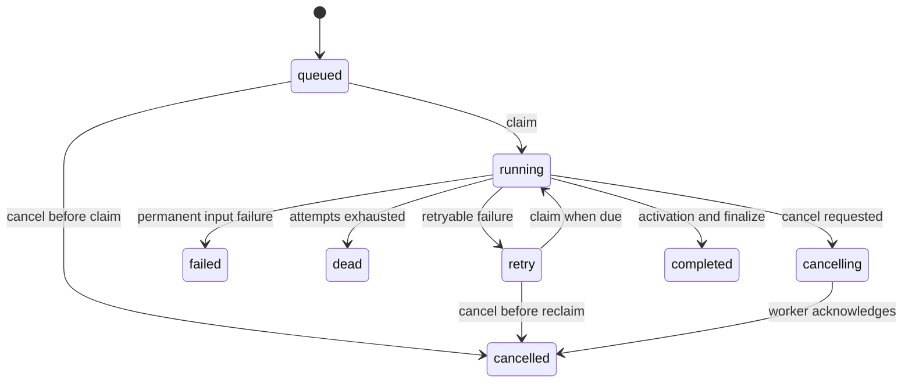
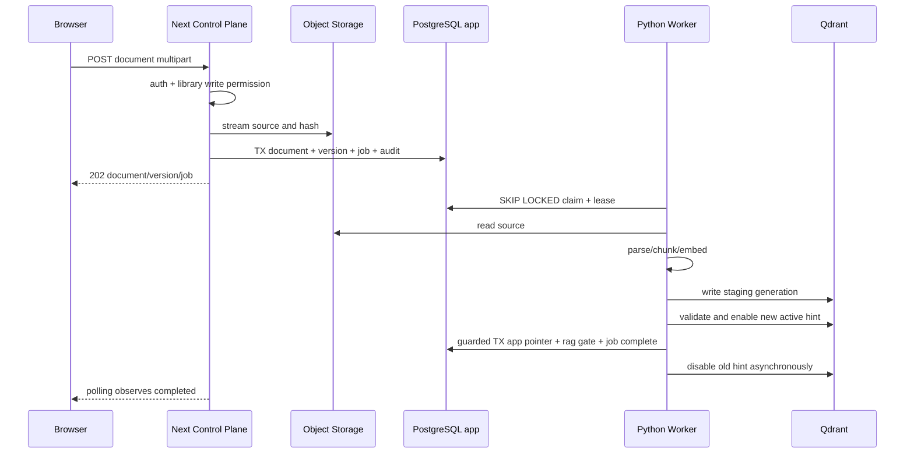

# MeriKnow 私有化企业知识库最终落地计划

> 日期：2026-07-24  
> 状态：实施中（L0–L7 主路径完成；L8 私有化部署包首片已落地，Helm/SBOM 后置）  
> 关联文档：
> [企业 RAG 主蓝图](../architecture/enterprise-rag-saas-design.md) ·
> [Next.js 控制面 ADR](../adr/0004-nextjs-control-plane.md)

## 0. 计划定位

本文不是方向性蓝图，而是从当前代码走到可上线私有化企业产品的实施合同。
Document Lifecycle 与生产级 Job 系统是贯穿控制面、数据面和检索面的主干，
其后以质量门禁、私有化部署和试点验收完成产品闭环。它覆盖：

- 文档首次上传、替换、重建索引、取消和删除；
- 文档版本、generation、active version 的一致性；
- Next.js 控制面、Python RAG 数据面、对象存储、PostgreSQL、Qdrant 的职责；
- 生产级任务认领、heartbeat、重试、取消、dead、恢复和巡检；
- 未激活版本不可召回、失败继续服务旧版本；
- API、数据迁移、测试、灰度和旧链路退出；
- 检索与回答质量发布门禁；
- 客户环境部署、备份恢复、升级和交付验收。

当前基础：

- DocumentIR、TableIR、MinerU、策略化切分和混合检索已经存在；
- `app.documents`、`app.document_versions`、`app.document_active_versions`、
  `app.jobs` 已有骨架；
- tenant/workspace/ACL 已进入 RequestContext 和 Qdrant payload；
- Library Outbox 已具备事务写入、顺序消费、heartbeat、dead 巡检和补偿；
- 当前浏览器上传仍代理到 FastAPI，Python ARQ 和 `public.documents.status`
  仍承担实际 ingest 状态。

本计划的任务是把这些能力收敛为一条生产路径，并形成可重复交付的私有部署
产品，而不是继续横向堆叠解析器或框架适配层。

### 0.1 当前完成度

| 领域 | 当前状态 | 本计划收口点 |
|---|---|---|
| 解析与切分 | DocumentIR、TableIR、MinerU、策略化切分已落地 | 接入版本化 Job，不重写解析器 |
| 检索与 Ask | QueryRouter、RetrievalPlan、混合检索、拒答已落地 | active generation、ACL 与质量门禁 |
| 权限与控制面 | organization/workspace/session/service auth 已有纵向切片 | 文档 API、对象与 Job 全链路统一 |
| 元数据一致性 | Library Outbox 已具备可靠性骨架 | 删除副作用和对账复用 Outbox，激活使用同库事务 |
| 评测 | 真实文件冒烟与黄金集已存在 | 固化发布熔断指标和环境分层 |
| 部署 | 可本机联调 | 形成客户可安装、升级、备份、恢复的交付包 |

### 0.2 最终阶段顺序

```text
L0-L3  先解决事实源、任务恢复、版本原子可见
L4-L6  接入真实解析、删除运维、退出旧链路
L7     固化检索与回答质量门禁
L8     完成私有化部署和升级恢复
L9     试点验收并进入正式发布
```

L0-L3 是当前第一批，未完成前不并行引入新的检索框架或大表执行引擎。

---

## 1. 最终目标

```text
Browser
  -> Next.js native document API
  -> customer-owned object storage
  -> app.document + version + job transaction
  -> Python worker claims app job directly from PostgreSQL
  -> parse -> chunk -> embed -> stage generation
  -> validation
  -> guarded PostgreSQL activation transaction
  -> RAG active-generation gate switches visibility
  -> job completed + deferred Qdrant hint cleanup
  -> old generation delayed cleanup
```

对用户必须表现为：

1. 上传立即返回 `202 + job_id`，不等待 MinerU 或 embedding。
2. 新版本处理期间，旧版本仍可查询。
3. 新版本完整成功前，任何新 chunk 都不可召回。
4. 失败可看到阶段、错误、parser report，并可安全重试。
5. Worker 崩溃、lease 过期、重复执行都不会产生重复可见数据。
6. 后上传的版本不会被先上传但后完成的旧任务覆盖。
7. 所有操作严格受 organization/workspace/role/ACL 约束。

---

## 2. 不可妥协的不变量

### I1. 单一业务事实源

`app.*` 是产品元数据和任务状态的唯一事实源：

- `app.documents`
- `app.document_versions`
- `app.document_active_versions`
- `app.jobs`
- `app.document_acl`

Python `public.*` 或未来 `rag.*` 只保存数据面投影和执行内部状态。

### I2. 单一任务事实源

`app.jobs` 是 ingest 任务的唯一队列与状态源。目标架构不允许：

- PostgreSQL 说 `queued`，Redis/ARQ 永久丢失却无人发现；
- ARQ 已完成，但产品数据库仍停在 `processing`；
- 两套 retry/dead 规则互相覆盖。

Python worker 使用受限数据库角色直接认领和更新任务。PostgreSQL
`FOR UPDATE SKIP LOCKED`、lease token 和 compare-and-set 是同机/同集群
私有部署的任务协议。现有 ARQ 仅作为迁移兼容链路，最终退出 ingest 主路径。

这里的“控制面拥有 `app.*`”指 Schema、约束和业务语义归 Next.js/Drizzle
维护，不代表所有运行时 DML 都必须绕行 Next.js HTTP。Worker 只获得明确列和
事务函数所需的最小权限，不得迁移 `app.*`，也不得修改身份、成员关系或 ACL。

### I3. 版本不可原地覆盖

每次上传或替换都创建新的：

- `document_version_id`
- 单调递增 `version`
- 全局唯一 `generation_id`
- 独立 `storage_key`

禁止直接覆盖当前 active version 的对象、IR 或向量。

### I4. 未激活 generation 永不召回

索引成功不等于可见。Qdrant 点必须携带：

```text
organization_id
workspace_id
library_id
document_id
document_version_id
generation_id
acl_scope
allowed_principal_ids
allowed_group_ids
pipeline_version
```

Retrieval 的底层 API 必须同时应用：

- tenant/workspace/ACL filter；
- active-generation gate；
- library/document 条件。

任何上层 Retriever、LangChain Tool、LlamaIndex adapter 都不得绕过该层。

### I5. 激活是可恢复 Saga

PostgreSQL 与 Qdrant 之间不存在真正的分布式事务。这里的“原子切换”定义为：

- 单次检索只接受一个 document generation；
- 不出现同一文档新旧 chunk 混答；
- 激活失败前旧 generation 保持可见；
- 任一中间步骤可通过相同 idempotency key 重放。

### I6. 后版本优先

Document 必须记录 `desired_version_id`。只有满足以下条件的版本可激活：

```text
job.document_version_id == document.desired_version_id
job.generation_id == version.generation_id
job still owns a valid lease
version.status == indexed
```

旧任务完成时若已存在更新的 desired version，应标记 `superseded` 并清理
staging generation，禁止覆盖。

### I7. 删除必须可追踪

删除先产生 tombstone/job，再异步清理 Qdrant、对象和数据面元数据。所有资源
完成清理前，不得丢失 tenant/workspace/document/generation 定位信息。

---

## 3. 系统边界与职责

| 组件 | 负责 | 不负责 |
|---|---|---|
| Next.js Control Plane | 浏览器 API、Auth/RBAC、文档/版本/job 创建、对象登记、审计、`app.*` Schema | PDF 解析、embedding、Qdrant 写入 |
| Python Worker | 受限 claim/update job、下载原文、DocumentIR/TableIR、切分、embedding、staging 索引、质量验证、受保护激活 | 浏览器会话、产品 RBAC、迁移 `app.*`、修改用户/成员/ACL |
| FastAPI RAG Data Plane | 检索、Ask、active-generation 解析、archive | 作为产品 metadata 或任务事实源 |
| PostgreSQL `app` | 产品事实源、job lease、版本指针、审计、Outbox | 大文件内容 |
| Object Storage | 原始文件和可选 IR artifact | 业务状态 |
| Qdrant | staging/active chunk、section、table records | 决定哪个版本是产品 desired version |
| Outbox | Library 投影、Qdrant hint/cleanup 等跨资源副作用 | ingest 调度、Job 状态、产品 active pointer |

### 3.1 部署边界不等于微服务边界

首个生产版本是一个模块化产品、两个语言运行时：

```text
web         Next.js Control Plane/BFF
rag-api     FastAPI Ask/Retrieval
rag-worker  Python ingest/delete worker
```

`rag-api` 与 `rag-worker` 使用同一 Python 镜像、不同启动命令。三者可以独立
扩容，但不为内部模块人为增加网络跳转。未来只有在远程 Worker、多集群控制面
或团队独立发布成为现实需求后，才把 PostgreSQL Job 协议替换为消息总线或
版本化 internal API。

### 3.2 架构取舍

| 方案 | 优点 | 主要问题 | 结论 |
|---|---|---|---|
| 纯 Next.js 全栈 | 单语言、CRUD 简单 | MinerU、Python RAG/ML 生态需要重新包装或外置，最终仍会出现 Python 服务 | 不选 |
| 纯 FastAPI | RAG 链路直接 | Session、OIDC、管理后台和产品数据演进成本更高，浏览器容易直接暴露数据面 | 不选 |
| 完整微服务 | 独立部署和团队边界清晰 | 内部 API、消息一致性、服务发现和运维成本过早 | 后置 |
| Next.js + Python + PostgreSQL Job | 利用各自生态，保留单一事实源，网络跳转少 | 需要严格数据库角色与跨语言 contract | 当前选择 |

“前后端分离”在这里表现为浏览器只访问 Next.js、RAG 计算留在 Python，并不
要求再增加独立 Node API 服务。性能扩展通过分别扩容 `web`、`rag-api` 和
`rag-worker` 完成，而不是先拆更多业务微服务。

---

## 4. 状态模型

### 4.1 Job status 与 stage 分离

不要把 `parsing/chunking/indexing` 全塞进 `status`。否则 retry、cancel 和
lease 会形成难以维护的组合状态。

#### Job status

```text
queued
running
retry
cancelling
cancelled
completed
failed
dead
```

#### Job stage

```text
accepted
downloading
parsing
chunking
embedding
indexing
validating
awaiting_activation
activating
cleanup
done
```

`status` 表示调度生命周期，`stage` 表示当前业务步骤。

### 4.2 合法状态迁移



硬规则：

- 所有迁移使用 `expected_status + lease_token` 做 compare-and-set；
- terminal 状态：`cancelled/completed/failed/dead`；
- `failed` 用于确定性输入错误，如不支持格式、加密 PDF、空内容；
- `retry` 用于 MinerU/Qdrant/模型/对象存储/网络暂时故障；
- `dead` 表示 retryable 错误耗尽次数，需要告警和人工重放。

### 4.3 Version status

```text
pending
processing
indexed
activating
active
failed
superseded
cancelled
deleting
deleted
```

只有 `active` 可以成为 `document_active_versions.version_id`。

### 4.4 Document status

Document status 是派生的产品摘要：

```text
empty       # 无 active version
processing  # 有 desired version 正在处理，可同时有 active version
ready       # desired == active
degraded    # 新 desired 失败，但旧 active 仍可服务
failed      # 无 active version，最近版本失败
deleting
```

不得让前端仅凭 document status 推断 job 的细节。

---

## 5. 数据模型改造

### 5.1 `app.documents`

新增：

```text
desired_version_id UUID NULL
latest_job_id UUID NULL
deleted_at TIMESTAMPTZ NULL
```

约束：

- `desired_version_id` 必须属于同一 document；
- `latest_job_id` 必须属于 desired version；
- 删除采用 tombstone，资源清理完成后再硬删除或按保留策略归档。

### 5.2 `app.document_versions`

保留现有字段并新增：

```text
pipeline_version VARCHAR(128) NOT NULL
parser_backend VARCHAR(64) NULL
chunk_profile VARCHAR(64) NULL
point_count INTEGER NULL
chunk_count INTEGER NULL
section_count INTEGER NULL
table_count INTEGER NULL
failure_code VARCHAR(128) NULL
superseded_at TIMESTAMPTZ NULL
```

约束：

- `(document_id, version)` 唯一；
- `generation_id` 全局唯一；
- `(document_id, id)` 复合唯一继续支持同文档 FK；
- `content_hash + pipeline_version` 可用于 retry 幂等，但不能代替 version ID。

### 5.3 `app.document_active_versions`

保留现有同文档复合 FK。激活事务必须：

1. 锁定 document；
2. 验证 desired version；
3. upsert active pointer；
4. 标记新版本 active；
5. 标记旧版本 superseded；
6. 更新 document 派生状态；
7. 写 audit/outbox。

### 5.4 `app.jobs`

在现有骨架上新增：

```text
stage VARCHAR(64) NOT NULL DEFAULT 'accepted'
max_attempts INTEGER NOT NULL DEFAULT 5
next_attempt_at TIMESTAMPTZ NULL
lease_token UUID NULL
lease_expires_at TIMESTAMPTZ NULL
heartbeat_at TIMESTAMPTZ NULL
cancel_requested_at TIMESTAMPTZ NULL
error_code VARCHAR(128) NULL
progress_current INTEGER NULL
progress_total INTEGER NULL
worker_version VARCHAR(128) NULL
```

调整：

- `claimed_at/claimed_by` 保留；
- `attempt` 在成功 claim 时递增；
- `progress` 保留为 0-100 的 UI 摘要；
- 详细单位使用 current/total；
- `payload` 只保存不可变执行参数；
- `result` 保存索引计数、parser report 摘要和 artifact key；
- 错误正文截断，完整诊断进入结构化日志或 artifact。

推荐索引：

```text
(status, next_attempt_at, created_at)
(lease_expires_at) WHERE status IN ('running', 'cancelling')
(workspace_id, updated_at)
(document_version_id, type)
```

### 5.5 RAG active-generation read model

Python 管理的 `rag.active_document_generations`：

```text
organization_id
workspace_id
library_id
document_id
document_version_id
generation_id
activated_at
PRIMARY KEY (organization_id, workspace_id, document_id)
```

它是同一 PostgreSQL 实例中的检索 read model，不是第二业务事实源。版本激活
使用一个数据库事务同时更新：

- `app.document_active_versions`；
- document/version/job 状态；
- `rag.active_document_generations`；
- audit 和必要的 cleanup outbox。

两个 Schema 仍由各自 migration 工具管理，但跨 Schema DML 可以处于同一事务。
如果客户将控制面与 RAG 数据拆成不同 PostgreSQL 实例，才启用 Outbox 投影模式。

---

## 6. 对象存储设计

### 6.1 接口

控制面与 Python 共用协议，不共用本地实现：

```text
put_stream(key, stream) -> size/hash
head(key)
open_stream(key)
delete(key)
copy/promote(staging_key, final_key)  # 可选
```

适配器：

- `local_shared_volume`：开发和单机私有部署；
- `s3_compatible`：MinIO、AWS S3 或客户对象存储。

### 6.2 Key 规范

```text
org/{organization_id}/
  workspace/{workspace_id}/
    library/{library_id}/
      document/{document_id}/
        version/{version_id}/source/{safe_filename}
```

禁止使用用户文件名作为唯一 key。

### 6.3 上传 Saga

对象存储无法加入 PostgreSQL 事务：

1. Next 生成 document/version/generation/job ID；
2. 流式写入 staging/final key，同时计算 SHA-256；
3. `HEAD` 校验 size/hash；
4. PostgreSQL 单事务写 document/version/job/audit；
5. DB 失败时 best-effort 删除对象；
6. 定时 sweeper 清理超过 TTL 且无 version 行的 orphan object。

首版不做浏览器直传；稳定后可增加 presigned multipart upload。

---

## 7. 端到端流程

### 7.1 首次上传



### 7.2 替换/新版本

- 锁定 document 分配 `version = max(version) + 1`；
- 创建新的 version/generation/job；
- 更新 `desired_version_id`；
- 旧 active pointer 不变；
- 新版本失败时：
  - version=`failed`；
  - job=`failed/dead`；
  - document=`degraded`；
  - 旧 active version 继续可检索。

### 7.3 Reindex

Reindex 不是原地改 active generation：

- 同一 document version 可创建新的 generation；
- 推荐新增 `document_version_runs`，或首版创建新 version 并标注
  `source_version_id`；
- pipeline/chunk/embedding 模型变化必须产生新 generation；
- 验证通过后走相同 activation 流程。

首版为降低 schema 复杂度：reindex 创建新 document version，复用相同
`content_hash/storage_key`，并记录 `source_version_id`。

### 7.4 Retry

- 只允许 `failed/dead/cancelled` 且源对象仍存在；
- 新建 job，不复活旧 job；
- 是否复用 generation：
  - parsing 前失败：可复用 version，但生成新 generation；
  - indexing 已部分写入：必须新 generation，旧 staging 异步清理；
- idempotency key：

```text
document.ingest:{version_id}:{generation_id}:{pipeline_version}
```

### 7.5 Cancel

- queued/retry：Control Plane 直接改 `cancelled`；
- running：写 `cancel_requested_at` 和 `cancelling`；
- worker 每个阶段和页批次检查取消；
- embedding/Qdrant 批次之间必须可中断；
- 取消后清理 staging generation；
- activation 一旦切换成功，不再执行普通 cancel，应创建 rollback/revert 版本。

### 7.6 Delete

删除文档：

1. 权限检查；
2. document 标记 `deleting`，创建 `document.delete` job/tombstone；
3. 取消未激活 ingest job；
4. RAG 清理 active/staging generations；
5. 删除对象；
6. 删除数据面 metadata；
7. Control Plane 标记 deleted；
8. 按审计保留策略延迟硬删除产品行。

删除 library 复用现有可靠 Outbox，但后续应 fan-out 为 document delete jobs，
避免一个超大 library delete 长时间占用单个 HTTP 请求。

---

## 8. API 合同

### 8.1 Browser-facing Next.js API

```text
POST   /api/libraries/{libraryId}/documents
POST   /api/documents/{documentId}/versions
GET    /api/libraries/{libraryId}/documents
GET    /api/documents/{documentId}
GET    /api/documents/{documentId}/versions
DELETE /api/documents/{documentId}

GET    /api/jobs/{jobId}
POST   /api/jobs/{jobId}/retry
POST   /api/jobs/{jobId}/cancel
```

上传响应：

```json
{
  "document_id": "uuid",
  "document_version_id": "uuid",
  "generation_id": "uuid",
  "job_id": "uuid",
  "status": "queued"
}
```

Job 响应至少包含：

```json
{
  "id": "uuid",
  "type": "document.ingest",
  "status": "running",
  "stage": "parsing",
  "progress": 23,
  "attempt": 1,
  "max_attempts": 5,
  "error_code": null,
  "error": null,
  "parser_report": null,
  "created_at": "...",
  "started_at": "...",
  "updated_at": "..."
}
```

### 8.2 PostgreSQL Worker 协议

首版不建设 Control Plane internal Job API。Python Worker 通过受限数据库连接
调用固定 repository/事务函数：

```text
claim_jobs(worker_id, capabilities, capacity)
heartbeat_job(job_id, lease_token, progress)
complete_ingest(job_id, lease_token, result)
fail_job(job_id, lease_token, error)
acknowledge_cancel(job_id, lease_token)
activate_generation(job_id, lease_token, generation_id)
```

这些名称表示稳定的应用协议，不要求全部实现为 PostgreSQL stored procedure。
简单 claim/heartbeat 可由参数化 SQL repository 实现；涉及 active pointer、
read model、job 和 audit 的多表状态迁移应封装为单一事务函数并集中测试。

每次 Worker 更新必须同时匹配：

```text
job_id
lease_token
expected status
lease_expires_at > now
document_version_id
generation_id
```

Worker descriptor 从 job payload 和关联版本表读取，organization/workspace/ACL
不接受进程环境变量覆盖。

### 8.3 内部 HTTP 边界

首版只保留确有网络边界价值的内部 HTTP：

- Next.js BFF -> FastAPI Ask/stream；
- 现有 Library Outbox -> 幂等 RAG projection/cleanup；
- health/readiness 和必要的运维只读接口。

这些接口继续使用 method/path/body 绑定的 service HMAC、重放保护和最小 scope。
Document ingest 的 claim、progress、activation 和 fail 不经 HTTP。未来远程
Worker 或多集群成为真实需求时，可以在 PostgreSQL Worker 协议前增加 API 或
消息总线，而不改变 Job 状态模型。

---

## 9. Worker 与 lease

### 9.1 Claim

Worker Job Repository 使用：

```sql
SELECT ...
FROM app.jobs
WHERE status IN ('queued', 'retry')
  AND (next_attempt_at IS NULL OR next_attempt_at <= now())
ORDER BY created_at
FOR UPDATE SKIP LOCKED
LIMIT :capacity;
```

同事务：

- status -> running；
- attempt + 1；
- 生成 lease_token；
- 设置 lease_expires_at；
- claimed_by/claimed_at/heartbeat_at。

### 9.2 Heartbeat

- 默认 lease 120 秒；
- worker 每 30 秒续租；
- MinerU 长请求期间也必须 heartbeat；
- heartbeat 失败立即停止后续写入；
- 任何完成/失败更新都必须 CAS lease_token。

### 9.3 Reaper

定时任务扫描：

```text
status in (running, cancelling)
lease_expires_at < now()
```

处理：

- 未超过 max_attempts -> retry + backoff；
- 超过 -> dead；
- stage=activating 时不得直接回到 parsing，应从 activation checkpoint 恢复；
- 记录 `job.lease_expired` audit。

### 9.4 Backoff

```text
base 10s
exponential
max 15m
jitter ±20%
```

错误分类决定是否 retry：

| 错误 | 处理 |
|---|---|
| unsupported/encrypted/empty | failed |
| MinerU 429/5xx/timeout | retry |
| embedding 429/5xx | retry |
| Qdrant timeout/unavailable | retry |
| invalid IR invariant | failed |
| storage temporary unavailable | retry |
| source object missing | failed |
| ACL/scope mismatch | failed + security alert |

---

## 10. Generation 索引与激活

### 10.1 Staging 写入

Python 写入时统一传递真实 Control Plane UUID：

```text
document_version_id = app.document_versions.id
generation_id = app.document_versions.generation_id
```

逐步删除 `derive_document_version_id("doc:v1")` stub。

Point ID 必须包含 generation，确保重复执行同 generation 幂等、不同 generation
互不覆盖：

```text
hash(generation_id, record_type, stable_record_id)
```

### 10.2 验证门

进入 `indexed` 前必须验证：

- parser report 没有违反 fail-closed 规则；
- chunk/section/table point 数与预期一致；
- 所有 point 的 tenant/workspace/document/version/generation 完整；
- 至少有一个可检索 record，除非显式 empty policy；
- Qdrant count/filter 抽样通过；
- 可选 embedding dimension/model fingerprint 一致。

### 10.3 Active gate

检索采用两层保护：

1. Qdrant payload active hint 用于预过滤；
2. `ActiveGenerationResolver` 对最终候选执行强校验。

激活协议：

1. 验证 generation staging 完整；
2. 读取旧 active generation；
3. 更新新 generation active hint；
4. PostgreSQL 单事务验证 desired version 和 lease；
5. 同事务切换 `app.document_active_versions` 与
   `rag.active_document_generations`；
6. 同事务完成 version/job/audit，并登记旧 generation cleanup；
7. 异步更新旧 generation inactive hint；
8. 重复调用返回同一结果。

即使 Qdrant payload 更新中途失败，最终 gate 仍以 active-generation row 为准，
不会混入未激活结果。Hint 切换窗口内检索必须 oversample；若强校验过滤后不足
`top_k`，应扩大候选重试，避免旧 hint 暂留造成召回不足。

### 10.4 旧版本清理

- 激活后延迟清理，不在用户请求内执行；
- 默认保留最近 1 个 inactive generation 或 24 小时；
- archive citation 引用旧 version 时，产品 metadata 和原文件按合规策略保留；
- 删除 Qdrant generation 不等于删除审计记录。

---

## 11. 安全设计

### 11.1 Worker 数据库身份

Worker 使用与 Next.js、migration 完全不同的 PostgreSQL role：

```text
meriknow_migrator  # 部署期 DDL
meriknow_web       # app 业务 CRUD
meriknow_worker    # jobs/version/activation 的受限 DML
meriknow_rag_read  # FastAPI 检索所需只读数据
```

`meriknow_worker`：

- 可读取待处理 job、关联 document/version 和必要 ACL snapshot；
- 可更新自己持有 lease 的 job 与关联 version 执行字段；
- 可在受保护事务中切换 active pointer/read model；
- 可写处理 audit 和 cleanup outbox；
- 不可迁移 Schema；
- 不可写 organizations、users、memberships、groups、document ACL；
- 不使用 PostgreSQL owner/superuser。

对象存储和 Qdrant 同样使用 worker 专用凭据。Next.js -> FastAPI 的 Ask 和现有
Library projection HTTP 仍使用独立 service HMAC，不能回落到 session secret。

### 11.2 Browser RBAC

| 操作 | 最低角色 |
|---|---|
| 查看文档/job | viewer 且有 library/document read |
| 上传/替换/retry | editor |
| cancel 自己触发的任务 | editor |
| 删除文档 | admin/owner，或明确的 library manage 权限 |
| 查看完整错误/运维字段 | admin/owner/auditor |

不存在的资源和无权限资源统一返回 404，避免枚举。

### 11.3 内容安全

- filename 仅展示，不参与路径拼接；
- MIME、扩展名和 magic bytes 联合校验；
- 限制文件大小、页数、压缩展开大小；
- zip bomb、加密文件、恶意 Office 宏显式失败；
- 日志不记录原文和完整 OCR 内容；
- 对象存储使用 customer-owned key/KMS；
- 后续可插入 antivirus/quarantine stage，不改变状态机。

---

## 12. 可观测性与运维

### 12.1 指标

最低指标：

```text
jobs_queued
jobs_running
jobs_retry
jobs_dead
job_duration_seconds{stage,type}
job_failures_total{stage,error_code}
job_lease_expired_total
parser_duration_seconds{backend}
embedding_batches_total{model}
qdrant_points_written_total
activation_lag_seconds
staging_generation_age_seconds
orphan_objects_total
```

### 12.2 Trace

贯穿字段：

```text
request_id
job_id
document_id
document_version_id
generation_id
organization_id
workspace_id
worker_id
attempt
pipeline_version
```

### 12.3 Audit

至少记录：

```text
document.uploaded
document.version_created
job.claimed
job.retried
job.cancel_requested
job.failed
job.dead
document.version_indexed
document.version_activated
document.version_superseded
document.deleted
```

### 12.4 Runbook

必须提供：

- dead job 检查与选择性 retry；
- stuck activating 修复；
- staging generation 清理；
- orphan object 清理；
- active pointer 与 RAG active gate 对账；
- MinerU/Qdrant/embedding 故障恢复；
- worker 安全下线与 drain。

---

## 13. 测试与发布熔断

### 13.1 单元测试

- 状态迁移表；
- retry 分类和 backoff；
- version allocation；
- desired/active/superseded 判定；
- point ID generation 隔离；
- service HMAC method/path/body/replay；
- cancel checkpoints；
- progress 单调性。

### 13.2 PostgreSQL 集成测试

- 两个 worker 不会 claim 同一 job；
- heartbeat 中的 job 不会被 reaper 回收；
- lease 过期可被重新 claim；
- 旧 lease_token 不能更新新 owner；
- version/job/outbox 事务回滚；
- 并发 replace 分配不同 version number；
- 旧 job 不能激活覆盖新 desired version；
- active pointer 同文档 FK 生效。

### 13.3 Qdrant 集成测试

- staging generation 搜索不可见；
- 激活后只返回新 generation；
- 激活失败仍返回旧 generation；
- 新旧 point 同时存在时 gate 不混答；
- tenant/workspace/ACL + generation 联合过滤零泄漏；
- retry 同 generation 不增加重复点；
- cleanup 不删除其他 tenant/document generation。

### 13.4 真实文件 E2E

依次纳入：

1. MD：稳定、快速，验证完整状态机；
2. DOCX/TXT；
3. 文本 PDF；
4. 扫描 PDF + MinerU；
5. 跨页表和低质量 OCR。

每类至少覆盖：

- 首次成功；
- 新版本成功；
- 新版本失败旧版本继续回答；
- cancel；
- worker 崩溃恢复；
- 删除；
- citation 携带真实 document_version_id。

### 13.5 发布熔断项

任何一项失败不得发布：

- 跨 tenant/workspace 泄漏；
- 未激活 generation 被召回；
- 新版本失败导致旧版本不可用；
- 旧 job 覆盖新 desired version；
- 重复执行产生重复可见 chunk；
- delete 完成后仍可召回；
- dead/stuck job 无巡检手段。

---

## 14. 分阶段实施

## Phase L0：合同与 Schema

目标：把状态、不变量和数据库约束固定下来。

状态：**完成**

- [x] 为 documents/version/jobs 增加本文字段和约束；
- [x] 使用 DB check constraint 固定 status/stage 集合；
- [x] 增加 desired_version 同文档 FK；
- [x] 增加 job claim/reaper 索引；
- [x] 定义 TypeScript/Pydantic 共享枚举和 JSON contract fixtures；
- [x] 建立 migrator/web/worker/rag-read 四类数据库角色；
- [x] 定义 Worker Job Repository SQL contract 和事务边界；
- [x] 编写迁移 preflight 和 rollback/runbook；
- [x] 更新 ADR，明确 `app.jobs` 是唯一任务队列且首版不经内部 HTTP。

Done：

- migration 可在空库和当前本机库执行；
- 不合法状态/跨文档 active/desired pointer 被数据库拒绝；
- Node/Python status/payload contract vector 双向通过；
- worker role 权限正例和越权拒绝测试通过。

## Phase L1：MD 原生上传与 Job 控制面

目标：只接 MD，先跑通产品事务和任务管理。

状态：**完成**

- [x] Next native multipart upload route；
- [x] local shared-volume object adapter；
- [x] 流式 SHA-256、大小和 filename 安全校验；
- [x] 单事务创建 document/version/job/audit；
- [x] Job GET/list/retry/cancel API；
- [x] 文库 UI 展示 job stage/progress/error；
- [x] feature flag `DOCUMENT_LIFECYCLE_V2`。

Done：

- 上传在解析开始前返回 202；
- editor/viewer/admin 权限测试通过；
- DB 或对象写失败不产生不可追踪状态；
- browser-facing API 不暴露 Worker 数据库凭据或 FastAPI 写接口。

## Phase L2：Python Worker 与 Staging Generation

目标：复用现有 MD parser/chunker/embed，禁止直接 ready。

状态：**完成**

- [x] 新 worker loop 通过受限 PostgreSQL role claim；
- [x] Job Repository 实现 lease/heartbeat/CAS；
- [x] 下载 source object；
- [x] 每阶段 progress/checkpoint/cancel；
- [x] pipeline 接受真实 version/generation UUID；
- [x] Qdrant point ID 加 generation；
- [x] staging point 默认不可见；
- [x] 索引计数和 parser report 回写；
- [x] retry/dead/reaper；
- [x] 同 generation 重放幂等。

Done：

- MD 可处理到 `indexed/awaiting_activation`；
- 搜索仍看不到 staging generation；
- worker kill -9 后 lease 到期可恢复；
- retry 不产生重复点。

## Phase L3：激活与检索 Gate

目标：实现旧版本持续服务和逻辑原子切换。

状态：**完成**

- [x] `rag.active_document_generations`；
- [x] ActiveGenerationResolver；
- [x] retrieval 底层强制 gate；
- [x] 跨 `app`/`rag` Schema 的受保护激活事务；
- [x] desired version + lease + generation CAS；
- [x] Qdrant active hint 与补偿 cleanup；
- [x] superseded 判定；
- [x] inactive generation 延迟 cleanup；
- [x] citation 使用真实 version ID。

Done：

- 新版本失败时旧答案与 citation 不变；
- 新版本激活后单次查询不混合新旧 generation；
- 旧 job 晚完成不会覆盖新版本；
- 激活事务和 Qdrant hint 补偿可安全重放。

## Phase L4：PDF/MinerU 与生产错误分类

目标：把已验证解析能力接入新生命周期。

状态：**完成**

- [x] TXT/DOCX/文本 PDF 接入；
- [x] MinerU 长任务 heartbeat；
- [x] page-level parser progress；
- [x] OCR/复杂表 parser report 回写；
- [x] timeout、429、5xx 分类；
- [x] 大文件 cancel；
- [x] 真实文件黄金回归。

Done：

- 现有真实测试文件全部走 V2 lifecycle；
- MinerU 中断/超时不破坏旧 active version；
- parser report 可在 UI 查看。

## Phase L5：删除、运维与 UI 完整性

目标：补齐企业运维闭环。

- [x] document delete job/tombstone；
- [x] library delete fan-out；
- [x] job retry/cancel UI；
- [x] version history 和 active 标识；
- [x] dead/stuck/orphan dashboards 或 CLI；
- [x] object/generation sweepers；
- [ ] audit 页面或导出；
- [x] worker drain/health/readiness。

Done：

- 删除可恢复、可审计；
- dead 与 orphan 可发现、可补偿；
- 管理员无需查数据库即可处理常见失败。

### L5 落地说明（2026-07-24）

- `DELETE /api/libraries/{id}/documents/{docId}` → document tombstone + `document.delete` job；
- library 删除 fan-out 为 per-document delete jobs，空库仍立即 outbox `library.delete`；
- lifecycle worker 认领 `document.delete` / `document.ingest`，并支持 `LIFECYCLE_WORKER_READY_FILE`；
- generation cleanup sweeper（L4/L5）继续清理到期 Qdrant 点；
- `pnpm lifecycle:inspect` 巡检 dead/stuck/deleting/orphan cleanup；
- 文档详情展示版本历史与 active 标识；job retry/cancel UI 沿用 L3/L4；
- 未做：完整 audit 页面/CSV 导出（审计行已写入 `app.audit_logs`）。

## Phase L6：迁移与旧链路退出

目标：只有一条生产路径。

- [x] 现有 `app.documents` 数据回填 version/active pointer；
- [x] 旧 Qdrant 点重新索引并补 generation/ACL；
- [x] 浏览器不再调用 `/v1/ingest/upload`；
- [x] `/v1/.../reindex|replace` 标记 internal/deprecated；
- [x] 禁用 ARQ ingest enqueue；
- [x] 删除 `derive_document_version_id` stub；
- [x] `public.documents` 降为兼容投影；
- [x] 移除双写和 document list probe 同步；
- [x] production 默认开启 V2，移除 feature flag。

Done（代码侧）：

- 全仓产品路径只有 `app.jobs` 一套任务状态；
- 提供存量 version/active 与 Qdrant generation/ACL 回填工具与 runbook；
- 无浏览器直连 FastAPI 写接口；
- `derive_document_version_id` 已删除。

仍依赖运维执行回填，以及逐步把 FastAPI `ingest_http` 单测换成控制面 V2 E2E。

### L6 落地说明（2026-07-24）

已落地：

- `LEGACY_INGEST_WRITES_ENABLED` 默认 `false`；production 禁止开启；
- FastAPI `/v1/ingest`、`/v1/ingest/upload`、`/v1/documents/{id}/replace|reindex`、
  `DELETE /v1/documents/{id}` 在关闭时返回 `410`；
- ARQ `enqueue_ingest_job` 同步拒绝；
- Next BFF `/api/rag` 对上述写路径 fail-closed `410`；Ask/stream/HMAC 保留；
- 浏览器上传/替换/重索引/列表只走控制面；移除 list probe 与 `syncRagDocument` 双写；
- `DOCUMENT_LIFECYCLE_V2` 默认开启（仅显式 `false` 可关）；
- `activate_generation` / `prepare_activation` 拒绝 `deleting`/`deleted`；
  library 刷新保留 `deleting`；`alreadyQueued` delete 重申 cancel/version→deleting；
- 控制面 `POST .../documents/{id}/reindex` 复用 storage_key 入队 `document.ingest`；
- `apps/web/scripts/backfill-lifecycle-versions.mjs` 回填 version/desired/active；
- `apps/api/scripts/backfill_qdrant_lifecycle_payload.py` 为旧点补 generation/ACL；
- 删除 `derive_document_version_id`；`public.documents` 文档化为兼容投影。

仍后置（运维执行，非代码缺口）：

- 在客户库上实际跑 backfill + 控制面 reindex；
- 将剩余 FastAPI `ingest_http` 单测逐步换成控制面 V2 E2E（仍由
  `LEGACY_INGEST_WRITES_ENABLED` 覆盖迁移期单元测试）。

## Phase L7：检索、回答与评测发布门禁

目标：把当前黄金集提升为每次发布都必须通过的产品合同。

- [x] 固定离线数据集版本、pipeline version 和报告 schema；
- [x] 将 ingestion、retrieval、answer 三层指标分开；
- [x] 保留确定性 CI 小集，增加真实 embedding/MinerU 受控集成集；
- [x] 覆盖 fact、summary、table、ambiguous、拒答和 ACL 用例；
- [ ] archive 固化 query type、plan、judge、citations 和版本信息；
- [x] 建立失败样本回流流程，线上反馈必须先进入 eval case；
- [x] 输出基线与候选版本对比报告，禁止只看总通过数。

首批硬指标：

| 指标 | 发布要求 |
|---|---|
| tenant/workspace/group 泄漏 | `0`，熔断 |
| 未激活/已删除 generation 召回 | `0`，熔断 |
| table 执行准确率 | 不低于已确认基线 |
| 拒答 precision | 不低于已确认基线 |
| citation coverage | 不低于已确认基线 |
| Ask 延迟 P50/P95 | 不高于环境基线预算 |
| ingest 成功率与阶段耗时 | 可按格式/parser 分解 |

Done：

- PR 跑确定性小集，release candidate 跑真实服务集；
- 报告记录代码 commit、模型、配置、数据集和依赖版本；
- 任一硬指标退化必须显式审批，不能用总分上涨掩盖。

### L7 落地说明（2026-07-24）

- `scripts/run_release_gates.py --mode ci|release` + baselines + report schema
  `meriknow.release_gate.v1`；
- `.github/workflows/eval-gates.yml` 跑 CI 确定性门禁；
- fuse tag（`fuse`/`isolation`/拒答期望）失败即熔断；层 pass_rate 低于 baseline
  需 `--allow-regression` 显式审批（不能解除 fuse）；
- runbook：`docs/runbooks/quality-release-gates.md`。

仍后置：

- archive 字段与线上延迟/成功率预算的环境基线固化；
- live MinerU/embedding 受控集成集接入 release 流水线（当前 release 模式仍可
  本地 stub 全量黄金集）。

## Phase L8：私有化部署、升级与灾备

目标：交付客户可以掌控数据、密钥和基础设施的安装包。

- [x] 提供 Docker Compose 单机参考拓扑；
  （`deploy/compose/docker-compose.yml` + `deploy/docker/*`）
- [ ] 提供 Kubernetes/Helm 生产拓扑和容量参数；**(后置)**
- [x] PostgreSQL、Qdrant、Redis、对象存储均支持客户托管连接；
  （`.env` 连接串；默认 Compose 卷，可改为外部托管）
- [x] LLM/embedding/rerank/MinerU 使用客户 endpoint/key；
- [x] secret 只从环境或 secret manager 注入，不进入镜像和日志；
- [x] production 配置 fail-closed，禁用浏览器直连 FastAPI 写接口；
  （Caddy 仅反代 web；api 不发布端口；见 runbook）
- [x] migration 作为独立部署步骤，运行账号不持有 DDL 权限；
  （`migrate` profile + `configure-runtime-roles.sql`）
- [x] readiness 覆盖 DB/Qdrant/storage/control-plane compatibility；
  （Compose healthcheck + `docs/runbooks/private-deployment.md` §3）
- [x] 支持 worker drain、滚动升级和 pipeline version 并存；
  （`upgrade.sh` SIGTERM drain；`stop_grace_period`）
- [x] 制定 PostgreSQL、对象、Qdrant 的备份与恢复顺序；
  （`backup.sh` / `restore.sh`）
- [x] 提供安装、升级、回滚、扩容、故障恢复 runbook；
  （`docs/runbooks/private-deployment.md`）
- [ ] 生成 SBOM、锁定镜像版本并完成依赖/镜像安全扫描。**(后置；Compose 已 pin 镜像 tag)**

交付入口：[`deploy/README.md`](../../deploy/README.md) ·
[`docs/runbooks/private-deployment.md`](../runbooks/private-deployment.md)。

推荐拓扑：

```text
Browser
  -> Reverse Proxy / TLS
      -> Next.js Control Plane
      -> FastAPI RAG Data Plane (internal routes network-restricted)
  -> PostgreSQL
  -> Qdrant
  -> Redis (cache/transition compatibility only)
  -> MinIO or customer S3
  -> Python Workers
  -> MinerU / model endpoints
```

Done：

- 在全新客户式环境中只依赖文档即可完成安装；
- 备份恢复后 active version、ACL、citation 与对象一致；
- 从前一版本升级和回滚演练通过；
- 断开外网后，除客户明确配置的模型 endpoint 外仍可运行；
- 所有运行组件都有 health/readiness、资源限制和日志保留策略。

## Phase L9：试点验收与正式发布

目标：用真实客户工作负载验证产品承诺，而不是仅验证功能列表。

- [ ] 选择 1-2 个工作区和代表性文件集做封闭试点；
- [ ] 记录文件格式、大小、页数、表格比例和目标问题；
- [ ] 执行权限、上传、替换、失败恢复、删除和审计验收；
- [ ] 执行 worker/Qdrant/MinerU/模型 endpoint 故障演练；
- [ ] 验证备份恢复、升级回滚和容量告警；
- [ ] 固化支持边界、已知限制、SLA/SLO 和问题升级路径；
- [ ] 形成版本化验收报告与 go/no-go 结论。

建议首版 SLO 先按可测量的产品行为定义：

```text
跨租户数据泄漏：0
已确认成功的写入不静默丢失
失败任务 100% 可定位到 stage/error_code
旧 active version 在替换失败时保持可用
dead/stuck/orphan 进入监控和运维队列
```

Done：

- 安全、数据一致性、质量和恢复演练全部通过；
- P0/P1 缺陷清零，P2 有负责人和计划；
- 安装包、runbook、评测报告和已知限制随版本一并交付；
- 获得明确 go 决策后再标记 production-ready。

---

## 15. 建议提交批次

为降低 review 风险，按以下独立提交推进：

1. `feat(db): define document lifecycle constraints`
2. `feat(db): add least-privilege worker role and job repository`
3. `feat(web): add native document upload transaction`
4. `feat(web): expose document job lifecycle APIs`
5. `feat(worker): process postgres lifecycle jobs`
6. `feat(rag): index isolated document generations`
7. `feat(rag): enforce active generation retrieval gate`
8. `feat(db): activate document generations transactionally`
9. `feat(web): expose job and version operations`
10. `chore: migrate and retire legacy ingest queue`
11. `test(eval): enforce retrieval and answer release gates`
12. `chore(deploy): package private deployment and runbooks`

每个提交必须包含对应测试，不允许最后统一补测试。

---

## 16. 代码落点

### Next.js

```text
apps/web/src/db/schema.ts
apps/web/src/app/api/libraries/[libraryId]/documents/route.ts
apps/web/src/app/api/documents/[documentId]/versions/route.ts
apps/web/src/app/api/documents/[documentId]/route.ts
apps/web/src/app/api/jobs/[jobId]/route.ts
apps/web/src/app/api/jobs/[jobId]/retry/route.ts
apps/web/src/app/api/jobs/[jobId]/cancel/route.ts
apps/web/src/lib/server/document-lifecycle.ts
apps/web/src/lib/server/job-state-machine.ts
apps/web/src/lib/server/object-storage/
apps/web/src/lib/server/service-auth/
apps/web/scripts/reconcile-document-versions.mjs
```

### Python

```text
apps/api/app/workers/document_jobs.py
apps/api/app/repositories/job_repository.py
apps/api/app/repositories/document_lifecycle_repository.py
apps/api/app/services/ingest/pipeline.py
apps/api/app/services/ingest/jobs.py
apps/api/app/services/ingest/index_record.py
apps/api/app/services/active_generations.py
apps/api/app/services/qdrant_store.py
apps/api/app/services/retrieval.py
apps/api/app/workers/reap_jobs.py
```

---

## 17. 明确后置

以下能力不阻塞首个 production-ready 版本：

- LlamaIndex hierarchical/summary retrieval A/B；
- LangChain Retriever adapter 完整封装；
- DuckDB/超大表执行；
- connector 增量同步；
- 云 SaaS 计费和套餐；
- 跨 region active-active；
- 全量 antivirus/DLP 产品化。

其中 LlamaIndex 可以在 L3 稳定后作为一种受 ActiveGenerationResolver 和 ACL
约束的检索实现接入，不能拥有版本、Job 或权限事实。

---

## 18. 最终 Done 标准

整个计划完成必须同时满足：

### 正确性

- 所有上传都有真实 document version 和 generation；
- 未激活 generation 零召回；
- 旧版本在新版本失败时继续服务；
- 激活后不混合新旧 chunk；
- citation 可定位真实版本；
- retry/cancel/delete 幂等。

### 安全

- 跨 organization/workspace/user group 零泄漏；
- viewer 不能上传、retry、cancel 或删除；
- worker service scope 最小化；
- internal API 不暴露给浏览器；
- 对象 key 和日志不泄露原文。

### 可靠性

- worker crash 可恢复；
- lease/heartbeat/reaper 有自动化测试；
- dead/stuck/orphan 可巡检和补偿；
- 激活与 cleanup 可重复执行；
- 旧任务不能覆盖新 desired version。

### 工程

- API、Web、PostgreSQL、Qdrant 和真实文件 E2E 全绿；
- production build 通过；
- migration 和 rollback/runbook 完整；
- 旧 ARQ ingest 和浏览器 FastAPI 写路径退出；
- 部署只需要运行一套 ingest worker 协议。

### 交付

- 客户可使用自己的数据库、对象存储、模型 endpoint 和密钥；
- 全新安装、版本升级、回滚与备份恢复均经过演练；
- 质量报告、审计、监控、runbook 和已知限制随版本交付；
- 试点 go/no-go 验收完成。

达到以上标准后，MeriKnow 才真正从“有企业能力的 RAG 应用”进入
“可承诺版本一致性、任务恢复和数据隔离的私有化企业知识库产品”。
